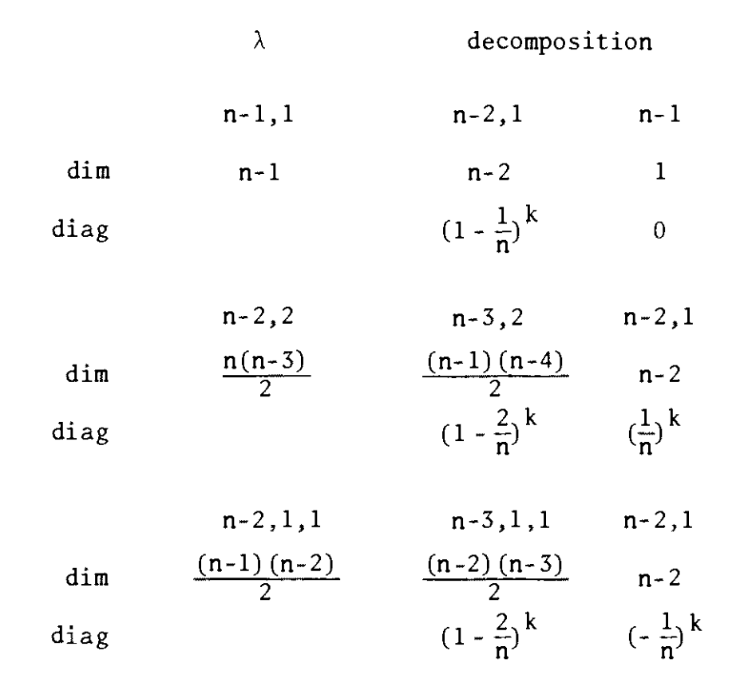

# Introduction

These lectures develop a set of tools that are useful for solving probability
problems connected to groups and homogeneous spaces. Here, the tools are used to
solve problems like how long should a Markov chain run to get close to its stationary distribution. In particular, how many times should a deck of cards be shuffled
to be close to random? The answer is, about 7 times for a 52 card deck.
A main component is the representation of the group involved as a subgroup of
a matrix group. Group representations is one of the most active areas of modern
mathematics. These notes may be regarded as an introduction, aimed at probabilists,
to noncommutative Fourier analysis.
The first topic is a set of introductory examples -- random walk on the discrete circle $\Z_n$, and the cube $\Z_2^n$.

These tools are specialized to a problem on the symmetric group: if a random
card and the top card are repeatedly transposed, it takes about $n \log n$ switches
to mix up $n$ cards. Analysis of this problem makes full use of the representation
theory of the symmetric group. On the other hand, because of the symmetries in-
volved (the measure is invariant under conjugation by all permutations fixing $I$) the
Fourier transforms are all diagonal matrices, so the analysis is not too difficult.
Highly symmetric measures often have simple Fourier transforms. In the easiest
case, the measure might be bi-invariant under a subgroup ($P(ksk') = P(s)$) arising
from a Gelfand pair. Then the Fourier transform is a matrix with a single non-zero
entry. If the measure is constant on conjugacy classes ($P(tst^{-1}) = P(s)$) the
Fourier transform is a constant times the identity matrix.
The example above introduces an interpolation between these two: there is a
group $G$ and subgroups $H \subset K$. The measure is invariant under conjugation by $H$
and bi-invariant under $K$. Then the Fourier transform is diagonal, so analysis is
still "simple". As shown, it is possible to explicitly comuute the diagonal entries
and answer any of the standard questions such as rates of convergence to stationarity, time to return, or hit a point, etc.

The next section applies the group theory to a practical problem -- generating
random "objects" on a computer. The objects might be things like permutations or
rotations. A general procedure -- the subgroup algorithm -- is developed, shown to
specialize to the best existing algorithms in familiar cases, and shown to give new
algorithms as well.

This leads to the problem of when can we take a square root of Haar measure in
a non-trivial way. The answer is a bit surprising -- never in the Abelian case, and
almost always in the non-Abelian case. For a finite group $G$, there is a non-uniform probability $Q$ such that $Q * Q = \text{Uniform}$, if and only if $G$ is not Abelian or
the product of some two-element groups with the eight element quaternion group.

## Prerequisites and background material

The material developed here uses only the basics of representation theory.
have chosen to build these notes around J. P. Serre's (1977) little book, Linear
Representations of Finite Groups . A careful reading of the first 30 or so pages of
Serre will suffice. I will make constant references to Serre as we go along, so
these notes may be regarded as a (hopefully) motivated way to work through Serre.

Alternative, highly readable sources for this material are Naimark and Stern
(1982) or Curtis and Reiner (1982). This last is also encyclopedic, containing
many further topics.
My favorite introductions to group theory are Herstein (1975), Rotman (1973),
and Suzuki (1982). Again, this last is extremely readable as an introduction, and
encyclopedic in scope.
Finally, find the surveys by Mackey (1978, 1980) make tantalizing
reading -- he seems to find everything related to group representations.
The present notes have some overlap with Diaconis (1982, 1987). There I develop the basic material more slowly, and present the statistical applications. Here,
I present fresh material on partially invariant probabilities and treat factorization problems. The two sets of notes use common notation, and may be regarded as complementary.

## Acknowledgement

Much of the material presented here has been developed over the years with co-authors. Chief among these is Mehrdad Shahshahani who taught me group representations. David Aldous, Fan Chung, and R. L. Graham have also been active collaborators. Jean Bretagnolle and Lucien Birge arranged my trip to Paris. P. L. Hennequin put a tremendous amount of energy into making all details work out. Phillipue Bougerol, Laura Ellie, and Claude Kipnis made my stay a pleasure. Thanks to all. [^edintro]

[^edintro]: Ed: The published version of these lecture notes are typewritten. I manually typeset this \LaTeX\ version both to enforce discipline in reading them for the first time, as well as to leave for myself a resource for future reference. JMJO, April 11 2025

# First Examples -- A Random Walk on the Circle.

To begin, consider the group of integers modulo $n$, denoted $\Z_n$,  as an additive group. I
usually think of $\Z_n$ as n points around a circle. The simplest random walk on $\Z_n$ can be described as a particle that hops left or right each time with probability $1 \over 2$. Mathematically we consider the probability $Q(1) = Q(-1) = {1\over 2}, Q(j) = 0$ otherwise.

Repeated steps are modeled by convolution. For probabilities $P$ and $Q$ on $\Z_n$,
$$P * Q(j) = \sum_{i=0}^{n-1}P(j-1)Q(i).$$
As usual, define $Q^{*n} = Q * Q^{*n-1}$.

The Fourier transform of a probability $P$ on $Z_n$ is familiar as the discrete Fourier transform of applied mathematics
\begin{equation}
  \hat{P}(j) = \sum_{k=0}^{n-1}e^{2\pi ijk \over n} P(k). \label{eq:dft}
\end{equation}
Thus for [the] simple random walk, $\hat{Q} = \cos \left(2\pi j\over n\right)$.

Let $U$ be the uniform distribution on $\Z_n$, so $U_j = {1 \over n}$ for all $j$. The fact that the roots of unity sum to zero gives $\hat{U} = 0$ if $j \ne 0$, $\hat U(0) = 1$. Fourier analysis proofs of convergence to uniformity work by showing that $\hat Q(j)^k$ converges to zero for all $j \ne 0$ as $k$ gets large.

It is easy to see from the definition \eqref{eq:dft} that transforms turn convolution
into multiplication:
$$
\hat{P * Q}(j) = \hat P(j) \hat Q(j).
$$
Finally, we have the Fourier inversion and Plancherel theorem
\begin{equation}
  P(j) = {1 \over n}\sum_{k=0}^{n-1} e^{- 2\pi i j k \over n} \hat P(k) \label{eq:inversion}
\end{equation}
\begin{equation}
  \sum_{j=0}^{n-1} P(j) Q(j) = {1 \over n}\sum_{k=0}^{n-1} \hat P(k) \hat Q(k) \label{eq:plancherel}
\end{equation}

These are easy to prove. Take \eqref{eq:inversion}: since both sides are linear in $P$, it
is enough to take $P(j)  \delta_m(j)$ , a point mass at $m$. Then $\hat \delta_m(k) = e^{2 \pi i m k \over n}$ and \eqref{eq:inversion} follows from the roots of unity summing to zero. For \eqref{eq:plancherel}, again both sides are linear in $P$ ; taking $P = \delta_m$ reduces to \eqref{eq:inversion}. Clearly \eqref{eq:inversion} and \eqref{eq:plancherel} remain true if $P$ and $Q$ are any functions, not necessarily probabilities.

We now have all the tools needed to analyze simple random walk on $\Z_n$. It is
intuitively clear that as time goes on the distribution of the particle tends to
uniform. To make this precise, we use the familiar total variation distance.
\begin{equation}
  \norm{Q^{* k} - U} = \max_A \left|Q^{*k} (A) - U(A)\right| = {1 \over 2} \sum_{j=0}^{n-1}\left|Q^{*k} - U(j)\right| = {1 \over 2} \max_{\norm{f} = 1}\left|\E_k(f) = \E_U(f)\right|. \label{eq:distance}
\end{equation}

\begin{theorem}
\label{thm:1}
Let $n$ be odd.  There are universal positive constants $a, b, c$,
such that for all $n$ and $k$,
\begin{equation}
  a e^{-{b k \over n^2}} \le \norm{Q^{*k} - U} \le ce^{- {b k \over n^2}}.\label{eq:constants}
\end{equation}
\end{theorem}

\paragraph*{Remarks}

(1) If $n$ is even, the particle is at an even position after an even num-
ber of steps and so never converges. This can be seen from the transform as well,
$\hat Q^k (n/2) = (-1)^k$, which does not converge to zero.
(2) The theorem says that to get close to uniform $k$ must be somewhat larger
than $n^2$. This can be seen from the central limit theorem; after all, the particle
must have a good chance of getting to the side opposite zero. But in $k$ steps,
the particle is quite likely to be within $\pm \sqrt k$ of zero, so $k \gg n^2$ is needed.
This can be made into a proof (but needs the Berry-Esseen theorem).
(3) The bounds above are uniform in $k$ and $n$. I think of $n$ large, and
wanting to know how large $k = k(n)$ should be to force the variation distance to
be small.

The proof of \autoref{thm:1} relies on the following useful lemma.
\begin{lemma}[upper bound lemma]
\label{lem:upperbound}
Let $P$ be a probability on $\Z_n$.
$$\norm{P - U}^2 \le {1 \over 4} \sum_{j=1}^{n-1} \left|\hat P(j)\right|^2.$$
\end{lemma}

\proof From the definition \eqref{eq:distance} of variation distance,
$$\begin{aligned} \norm{P - U} ^2 = {1 \over 4}\left(\sum_{j=0}^{n-1} \left|P(j) - U(j)\right|\right)^2 &\le {n \over 4} \sum_{j=0}^{n-1}|P(j) - U(j)|^2 \\ &= {1 \over 4} \sum_{j=1}^{n-1} |\hat P(j)|^2.\end{aligned}$$
The inequality is Cauchy-Schwarz. The final equality uses the Plancherel theorem \eqref{eq:plancherel} applied to $|P(j) - U(j)|$, and $\hat U(0) = \hat P(0), \hat U(j) = 0$ otherwise.

\paragraph*{Remark} The upper bound lemma has turned out to be a rather precise tool, despite
the apparent sloppy use of the Cauchy-Schwarz inequality. This is demonstrated by
the matching lower bound.

\proof[Proof of \autoref{thm:1}] Using the upper bound lemma we have
$$4 \norm{Q^{* k} - U}^2 \le \sum_{j=1}^{n-1} \cos \left(2 \pi j \over n\right)^{2k}.$$
To bound the sum we use simple properties of cosine. To begin with, $\cos {2\pi j \over n} = \cos {2 \pi (n-j)\over n}$, so the sum equals twice the sum from 1 to $(n-1)/2$. Next, for $0 \le x \le \pi/2$,
$$1 - \cos x = {x^2 \over 2} - {x^4 \over 24} + \ldots \ge {x^2 \over 2} - {x^4 \over 24} \ge {x^2 \over 2} \left(1 - \left({\pi \over 2}\right)^2 {1 \over 12}\right) \ge {x^2 \over 3}.$$
Since $e^{-x} \ge 1 -x$,
$$\cos x \le 1 - {x^2 \over 3} \le {e^{-{x^2 \over 3}}}\text{ for }0 \le x \le \pi/2.$$

Thus, for $u = e^{-{8\over9}{\pi^2 k \over n^2}}$,
\begin{equation}
  \sum_{1 \le j \le {n\over 4}} \cos \left(2 \pi j \over n\right)^{2k} \le \sum_{1 \le j \le {n\over 4}} u^{j^2} \le u + \sum_{j \ge 1} u^{2j} \le 2u \label{eq:upperbound}
\end{equation}
where the last inequality assumes $k \ge n^2$. Taking $c>1$ in \eqref{eq:constants} covers the other cases.[^exp]

[^exp]: Ed: I am pretty sure that the exponent of $u$ should be $8\over3$ rather than $8\over 9$, but the inequality should hold anyway.

Finally, for ${n \over4} < j \le {n - 1\over 2}$, let $\ell = j - {n-1 \over 2}$,
$$\cos \left({2 \pi \over n} \left({n-1\over2} - \ell\right)\right) = \cos \left(2\pi\left(\ell + {1 \over 2}\right) \over n\right),\ \ \ \ 0 \le \ell < {n \over 4}.$$
Precisely the same bound \eqref{eq:upperbound} applies with $u$ replaced by $u^{1\over2}$.

Combining bounds, we have
$$\norm{Q^{*k} - U} \le \sqrt{2} e^{-{2\over9} \pi^2 k / n^2}.$$
This completes the proof of the upper bound. For the lower bound, use he rightmost expression in \eqref{eq:distance} with $f(j) = \cos\left(2 \pi j \over n\right)$. It again follows from the sum of roots of unity being 0 that $\E_U(f) = 0$. From the definition of Fourier transform $\E_k(f) = \cos\left(2 \pi \over n\right)^k$. Thus,
$$2\norm{Q^{*k} - U} \ge \cos \left(2 \pi \over n\right)^k \ge \left(1 - {1 \over 2}\left({2\pi \over n}\right)^2\right)^k \ge e^{- 2\pi^2 k / n^2}$$
where $1 - x \ge e^{-2x}$, $0 \le x < {3\over 4}$ was used. \qed

\paragraph*{Remarks}

(1) Clearly with more work, slightly better constants can be had in the
inequalities. In particular the constants in the exponents can be taken as equal.

(2) Notice how much information about cosine was used. One of the problems
to be faced is developing such knowledge in the non-commutative case.

(3) This proof was given in such detail because it seems a model of what is
coming. In particular there is a lead term $\cos \left(2\pi \over n\right)^{2k}$
that dominates. The other terms sum up to something smaller.

(4) Similar arguments work for other simple measures on $\Z_n$, for example, a
step chosen each time uniformly in $[-a,a]$. If $a$ stays bounded, and $n$ gets
large, the rate is the same: more than $n^2$ steps are needed. It is unknown what
is the fastest converging measure with a given number of support points. For
example let $P$ put mass $1 \over 4$ on 4 points in $\Z_n$. What choice of points makes
$P^{*k}$ converge to uniform most rapidly? (I believe $k$ points can be chosen so that $n^{2 /(k+1)}$ steps suffice.)

(5) Even for a simple group like $\Z_n$, there can be very delicate problems.
Here is an example. In considering schemes to generate pseudo random numbers on a
computer, Chung, Diaconis and Graham (1987) studied random variables satisfying
\begin{equation}
  X_k = a X_{k-1} + \varepsilon_k\ (\mathrm{mod}\ n)\label{eq:markov}
\end{equation}
where $\varepsilon_k$ was a sequence of i.i.d. random variables on $\Z_n$. Observe that if $a = 1$,
this is essentially simple random walk on the circle. By our previous discussion, it takes somewhat more than $n^2$ steps to get random when $a=1$, if $\varepsilon_k$ is "small".

For more general values of a , the Markov chain \eqref{eq:markov} can be represented as a
convolution of independent variables as follows:
$$\begin{aligned}X_0 = 0, X_1= a X_0 + \varepsilon_1 = \varepsilon_1, X_2 &= a \varepsilon_1 + \varepsilon_2, X_3 = a^2 \varepsilon_1 + a \varepsilon_2 + \varepsilon_3, \ldots, \\ X_k &= a^{k-1} \varepsilon_1 + x^{k-2} \varepsilon_2 + \ldots + \varepsilon_k\ (\mathrm{mod}\ n). \end{aligned}$$
Thus $X_k$ has Fourier transform $\prod_{i=0}^{k-1} \hat Q(a^i k)$, with $Q$ the law of $\epsilon_i$. The upper bound lemma can be used to bound the distance to uniform.

Chung, Diaconis and Graham let $\varepsilon$ take values $0,\pm 1$ each with probability ${1 \over 3}$. When $a=1$, it takes $n^2$ steps to get random as for simple random walk.
When $a = 2$, and $n$ is of form $2^\ell-1$ , it takes about $\log n \log \log n$. This is
sharp (that many steps are needed). For almost all $n$, $1.02 \log n$ steps are
enough to get close to random, although no explicit sequence $n_i$ , tending to in-
finity, is known which gets random after $c \log n_i$ for any fixed $c$. The analysis
involved seems fairly delicate. No serious work has been done on the problem for
general values of $a \ne 2$.

# Random Walk on $\Z_2^n$.

The second example begins as a classical piece of mathematical physics -- the
Ehrenfest's urn scheme. This involves two urns containing collectively $n$ balls.
At a typical stage a ball is chosen at random and switched into the other urn.
Years ago, someone observed this could be lifted to a random walk on a group.

Let $\Z_2^n$ be the group of binary $n$-tuples with coordinatewise addition modulo 2.
Each coordinate stands for one of the $n$-balls, with a
representing the ball being in the left urn. A typical step in the chain thus becomes pick a coordinate at random and change the entry to its opposite mod 2. This is random walk with
$$P(100\ldots0) = P(010\ldots0) = \ldots = P(000\ldots1) = {1 \over n}.$$

This walk as a periodicity problem -- after an even number of steps it is at a
binary vector with an even number of ones. It is not hard to deal with even and
odd numbers of steps directly. Another possibility is to consider the walk in
continuous time. Let us get rid of periodicity in another way: allow the walk to
stay where it is with small probability. A natural candidate is
\begin{equation}
  Q(000\ldots0) = Q(100\ldots0) = Q(010\ldots0) = \ldots = Q(000\ldots1) = {1 \over n + 1}. \label{eq:rwalkz2n}
\end{equation}

To analyze repeated steps, the analog of the Fourier analysis used above is
needed. This is again easy and well known. The Fourier transform of any function
$P$ is just
$$\hat P(x) = \sum_y (-1)^{x \cdot y} P(y),$$
where $x \in \Z_2^n$ and the sum runs over the group. One way to see that this is the
appropriate definition is to observe that for $\Z_2$, the two roots of unity involved
in the Fourier transform are just $\pm1$. In general, the appropriate "dual group" of
a product is the product of the "dual groups".

The analog of the Fourier inversion theorem is
\begin{equation}
  P(y) = {1 \over 2^n} \sum_x (-1)^{x \cdot y} \hat P(x). \label{eq:z2inversion}
\end{equation}
This can be proved as above by specialising to $P$ a $\delta$ function when the result reduces to the classical formula of inclusion-exclusion (identifying $x \in \Z_2^n$ with the indicator function of a subset of $\left\{1,2,\ldots,n\right\}$). From here the Plancherel theorem follows by linearity. The upper bound lemma becomes
\begin{equation}
  \norm{P^{*k} - U}^2 \le {1\over4} \sum_{y\ne0}\left|\hat P(y)\right|^{2k}.\label{eq:z2upperbound}
\end{equation}

Using these results we will prove that a bit more than ${1\over4} n \log n$ steps are needed and suffice to get close to random.

\begin{theorem}
\label{thm:2}
For $Q$ defined by \eqref{eq:rwalkz2n} on the group $\Z_2^n$, let
$$k = {1\over4}(n+1)\log n + c(n+1).$$
Then
\begin{equation}
  \norm{Q^{*k} - U}^2 \le {1\over 2}\left(e^{e^{-4c}}-1\right);
\end{equation}
\begin{equation}
  \lim_{n\to\infty} \norm{Q^{*k} - U} \ge \left(1-8e^c\right).\label{eq:Qlower}
\end{equation}
\end{theorem}

\proof Let $|y|$ be the number of ones in the binary vector $y$. The Fourier transform is $\hat Q(y) = \sum_x (-1)^{x \cdot y} Q(x) = 1 - {2 |y| \over n+1}$. Using the upper bound lemma,
$$\begin{aligned}\norm{Q^{*k} - U}^2 &\le {1\over4} \sum_{y\ne0}\left(1 - {2 |y|\over n + 1}\right)^{2k} = {1\over4} \sum_{j=1}^n {^nC_j} \left(1 - {2 j\over n + 1}\right)^{2k} \\ &\le {1\over2}\sum_{j=1}^{n+1\over 2} {^n C_j}\left(1 - {2j \over n+1}\right)^{2k} \le {1\over2}\sum_{j=1}^\infty {n^j\over j!}e^{-{4 j k \over n + 1}} \\ &= {1\over2}\left(e^{e^{-4c}} - 1\right). \end{aligned}$$

This completes the proof of the upper bound. In this example, the proof of the
lower bound requires an extension of the idea used in \autoref{thm:1}. To explain, consider the just completed calculation for the upper bound. The dominant term is $n\left(1-{2\over n+1}\right)^{2k}$, all other terms being smaller. This dominant term arises from the Fourier transform at vectors $y$ with $|y| = 1$. The new idea is to use the "slow terms" in the upper bound lemma as a clue to defining a random variable on the group, with Fourier transform the slow terms.[^slowterms]

[^slowterms]: Ed: i.e. whose Fourier transform *is* the slow terms.

Here, this heuristic suggests we define the random variable
$$Z(x) = \sum_{i=1}^n (-1)^{x_i} = n - 2|x|.$$
Under the uniform distribution $U$ on $\Z_2^n$, the coordinates $x_i$ are i.i.d. Bernoulli with parameter $1\over2$. It follows that
\begin{equation}
  \E_U\left\{Z\right\} = 0, \Var_U\left\{Z\right\} = n. \label{eq:Zmoments}
\end{equation}

Under the measure $Q^{*k}$, the moments of $Z$ are
\begin{equation}
  \E_k(Z) = n\left(1 - {2 \over n + 1}\right)^k,\label{eq:eZ}
\end{equation}
\begin{equation}
  \Var(Z) = n + n(n-1)\left(1 - {4 \over n+1}\right)^k - \left[\E_k(Z)\right]^2.\label{eq:varZ}
\end{equation}
Indeed, from the definition of $Z$, $\E_k(Z) = \sum_{i=1}^n \E_k\left((-1)^{x_i}\right) = \sum_{i=1}^n \hat Q_k(e_i) = n\left(1-{2\over n+1}\right)^k$, where $e_i$ is a binary vector with a 1 in the i^th^ place and zeroes elsewhere. The proof of \eqref{eq:varZ} is similar. Straightforward estimates show that, for fixed $c$, as $n \to \infty$,
\begin{equation}
  \E_k(Z) = \sqrt{n}e^{-c/2} \left(1 + \mathcal{O}\left(\log n \over n\right)\right) \label{eq:EkZ}
\end{equation}
\begin{equation}
  \Var_k(Z) = n + \mathcal{O}(e^{-c} \log n).\label{eq:varkZ}
\end{equation}

Proceeding heuristically for a moment, Chebyshev's Inequality and \eqref{eq:Zmoments} imply that under $U$, $Z$ lives on $\pm 10\sqrt{n}$ to good approximation. On the other hand, \eqref{eq:EkZ}, \ref{eq:varkZ} imply that under $Q^{*k}$, $Z$ is suppored on $\sqrt{n} e^{-c/2} \pm 10 \sqrt{n}$, which is disjoint from $\pm 10\sqrt{n}$ to good approximation. It follows that the variation distance tends to 1 as $n$ tends to infinity.

Proceeding more rigorously, let $K = e^{-c/2}$ and $A = \{x \in \Z_2^n, |x| \le {n\over2} - {K \over 4} \sqrt{n}\}$. Chebyshev's Inequality implies
$$\begin{aligned}U(A) &\le {1 \over \left(K/2\right)^2} \\ Q^{*k}(A) &\ge 1 - {1 + \mathcal{o}(1) \over \left(K/2\right)^2}. \end{aligned}$$
This yields the lower bound \eqref{eq:Qlower}, from definition \eqref{eq:distance}. \qed

\paragraph*{Remarks}

(1) The neat argument given here owes much to participants at the St. Flour seminar.

(2) The argument for lifting a Markov chain to a random walk is abstracted
with further examples and problems given in Diaconis and Shahshahani (1987a).

(3) There is an important difference between the asymptotic behavior on the
cube and circle. On the cube, convergence to uniformity exhibits a "cutoff phenomenon", while convergence on the circle doesn't. To explain, you might think that the variation distance between $Q^{*k}$ and $U$ tends smoothly to zero as $k$ increases. In fact, in both the circle and cube (and most other examples) the variation distance stays quite close to its maximum value of 1
as $k$ increases, and then cuts down to a small value where it decreases to zero geometrically fast. The cutoff phenomenon happens in a neighborhood of the region of decrease.

For the $n$ point circle, if $k$ goes to infinity with $n$ in such a way that
$k/n^2$ tends to $\ell$, the variation distance tends to a continuous monotone decreas-
ing limiting function $\theta(\ell)$. (Indeed, computation shows that $\theta(\ell)$ is a "theta
function".)

Next consider the cube. If k tends to infinity with n in such a way that
$k/n \log n$ tends to $\ell$, the variation distance tends to a step function taking
value 1 if $\ell < {1 \over 4}$, and 0 if $\ell > {1 \over 4}$. It is not clear if the limit exists when $\ell = {1 \over 4}$.

The point for the present discussion is that for the cube, and most other examples, the transition from to a happens in a short time (in an interval of length $n$ at a scale of $n \log n$). For the circle the decrease happens in an interval of length proportional to $n^2$, at a scale of $n^2$.

The cutoff phenomenon happens so often, it has become a problem to explain it. See Section 6 of Aldous and Diaconis (1986).

(4) Simple random walk on the cube has been applied to a problem arising in
the analysis of algorithms related to the simplex algorithm of linear programming.
Aldous (1984) uses the analysis above to show that a large class of algorithms
must take an exponential number of steps to find the minimum of most "nice" functions on $\Z_2^n$.

(5) Here is a class of problems where similar analysis is of interest. In
considering the effect of stirring food while cooking, we often appeal to an ill
framed "ergodic theorem" for an explanation of why things get evenly browned. Seeking to formulate this more precisely, Richard Stanley and I consider $n$ potato slices arranged in a ring (as around the circumference of a frying pan). At each time, a spatula of radius $d$ is put in at a random position, and the $d$ potatoes under the spatula are turned over in place. It is intuitively clear that the pattern of "heads and tails" formed will tend to be uniformly distributed.

A first question is, how many moves does it take, and how does it depend on $d$? The results surprised us. To get rid of parity, assume that $n$ and $d$ are relatively prime. It turns out that then the variation distance to uniform behaves exactly like simple random walk on the cube;
${1\over 4} n \log n + c n$ moves suffice, no matter what $d$ is used.

The problem can be set up as a random walk on $\Z_2^n$ with underlying measure $Q$
uniform on the $n$ cyclic shifts of the vector beginning with $d$ ones and ending
with $n-d$ zeroes. From here, the analysis can be carried out as for \autoref{thm:2}.
However, there is a clever way to see why the result is true without calculation.
The reader is referred to Diaconis and Stanley (1986) for further discussion.

# The General Set-up, Examples, and Problems

Let $G$ be a finite group. Let $P$ and $Q$ be probabilities on $G$. Define, for $s \in G$,
$$P * Q(s) = \sum_t P(st^{-1}) Q(t).$$
Thus, to get $s$, one must first pick $t$ from $Q$ and then "undo" things by picking $st^{-1}$ from $P$. Now $P * Q \ne Q * P$ in general.

Fourier analysis is based on the notion of a *representation* of $G$. This is a homomorphism $\rho: G \to GL(V)$, where $V$ is a finite-dimensional vector space over the complex numbers. We denote $\dim V = d_\rho$. Thus, a representation assigns matrices to group elements in such a way that $\rho(st) = \rho(s) \rho(t)$.

The *Fourier Transform* of $P$ at representation $\rho$ is the matrix
$$\sum_s P(s) \rho(s).$$
From the definitions, the transform satisfies
$$\hat{P * Q}(\rho) = \hat P(\rho) \hat{Q}(\rho).$$

To go further, we need the notation of an irreducible representation. Define $(\rho, V)$ to be *irreducible* if there are no nontrivial subspaces $W$ in $V$ stable under $G$ in the sense that $\rho(s) W \subset W$ for all $s \in G$. Irreducible representations make up the building blocks of all representations, and are known (more or less explicitly) for almost any group arising in applications.

It may be useful to carry along an example. Consider $S_n$, the permutation group on $n$ letters. We will denote permutations by $\pi(i), 1 \le i \le n$. We are all familiar with three representations of $S_n$:

\paragraph*{The trivial representation.} Take $V = C$, and define $\rho(\pi)v = v$ for all $\pi$ and $v \in V$. This is a 1-dimensional representation.

\paragraph*{The alternating representation.} Take $V = C$, and define $\rho(\pi) = \sgn(\pi) \cdot v$, where $\sgn \pi = 1$ if $\pi$ can be written as an even number of transpositions, and $-1$ otherwise. A first course in group theory proves that $\sgn \pi \eta = \sgn \pi\ \sgn \eta$, so this is a representation of dimension 1.

\paragraph*{The permutation representation.} This assigns permutation matrices to permutations in the usual way. To define it, take $V$ as the usual $n$ dimensional space with basis $e_1, e_2, \ldots, e_n$, where $e_i$ has a 1 in the $i$^th^ position, and zeros elsewhere. To define a linear map $\rho(\pi)$ from $V$ to itself, it is sufficient to define $\rho(\pi)e_i = e_{\pi(i)}$ and extend by linearity. The matrix of $\rho(\pi)$ with respect to the basis $e_i$ is the usual permutation matrix.

This representation is reducible. Indeed, if $w = e_1 + e_2 + \ldots + e_n$, the linear span $W$ of $w$ is an irreducible space because $\rho(\pi)$ acts by permuting the coordinates. Similarly, $W^\perp = \{v \in V: \sum {v_i} = 0\}$ is a nontrivial invariant subspace. The linear mappings $\rho(\pi)$ send this space into itself, and one speaks of the restriction of $\rho$ to $W^\perp$. Clearly,$$V = W \oplus W^\perp.$$ The representation $W^{perp}$ is irreducible (see Serre's Exercise 2.6), so this gives a decomposition of $V$ into irreducible invariant subspaces.

For $n = 3$, there are only three distinct (non-isomorphic) irreducible representations: the trivial, alternating, and 2-dimensional representation.

It is an instructive exercise to compute the six $2\times2$ matrices for the 2-dimensional representation. One way to do this considers the basis $e_1-e_2$, $e_1-e_3$ for $W^\perp$. Apply $\rho(\pi)$ to these vectors and express as a linear combination of the basis vectors. For example, if $\pi$ is the transposition (12), $\rho(\pi)(e_1 - e_2) = -(e_1 - e_2), \rho(\pi)(e_1 - e_3) = e_2 - e_3 = (e_1 - e_3) - (e_1 - e_2),$ so the matrix is $\begin{bmatrix}-1 & 0 \\ -1 & 1\end{bmatrix}.$

As an example of a naturally occurring probability on $S_n$, consider the example of random transpositions. Imagine $n$ cards in a row on the table. To start, card one is at the left, card two is next, and card $n$ is at the right of the row. Each time, the left and right hands touch random cards (so $L = R$ with probability $1\over n$) and the two cards are switched. This defines a measure on $S_n$:
$$\begin{aligned}Q(\id) &= {1 \over n} \\ Q((ij)) &= {2 \over n^2} \\ Q(\pi) &= 0\text{ otherwise.}\end{aligned}$$
Repeatedly transposing is modeled by convolution, and one can ask (and answer) the usual questions. These problems are solved using Fourier analysis in Diaconis and Shahshahani (1981).

Return to the case of a general finite group $G$. The uniform distribution is denoted $U(s) = 1/|G|$. As for the Abelian case we have
\begin{lemma}For $\rho$ a nontrivial irreducible representation, $\hat U(\rho) = 0$.\end{lemma}

\proof Any argument for this needs Schur's Lemma (Serre (1977, Proposition 4). One simple way is to note $\hat{U}(\rho) = 1/|G| \sum_s \rho(s)$. Now the $(i,j)$ entry of this matrix
is the inner product of the function on $G$ defined by $\rho_{ij}(\cdot)$ and the function $1$.
But Serre's proposition shows that the matrix entries of distinct irreducible entries are orthonormal. \qed

The other basic results needed to work with Fourier analysis are the Fourier inversion and Plancherel formulas.

\begin{theorem}\label{thm:3}
Let $f$ be a function on $G$. Then

(a) $f(s) = {1 \over |G|} \sum_\rho d_\rho \Tr\left(\rho\left(s^{-1}\right)\hat f(\rho)\right)$.

(b) Let $f$ and $g$ be functions on $G$. Then
$$\sum_s f(s^{-1})g(s) = {1 \over |G|} \sum_\rho d_\rho \Tr\left(\hat f(\rho) \hat g(\rho)\right).$$
In both formulae, the sum is over all irreducible representations $\rho$ of $G$.
\end{theorem}

\proof (a) Both sides are linear in $f$, so it suffices to let $f$ run through a basis of all functions on $G$. For $f(s) = \delta_{st}, \hat f(\rho) = \rho(t)$. The right hand side equals
\begin{equation}
  {1 \over |G|} \sum_\rho d_\rho \Tr\left(\rho\left(s^{-1} t\right)\right).
\end{equation}
This expression is $1 \over |G|$ times the character of the regular representation evaluated at $s^{-1} t$; indeed Serre's Corolary 1 (pg. 18) says that each irreducible representation $\rho$ occurs $d_\rho$ times in the regular representation. Serre shows that the character of the regular representation is zero unless $s = t$, when the character is $|G|$. This proves (a).

For (b), again both sides are linear in $f$. Take $f(s) = \delta_{st}$; it must be shown that
$$g\left(t^{-1}\right) = {1 \over |G|} \sum_\rho d_\rho \Tr\left(\rho(t) \hat g(\rho)\right).$$
This was proved in part (a). \qed

\paragraph*{Remarks} (1) The Fourier inversion theorem shows how knowing $f(\rho)$ at all the
irreducible representations determines $f$.

(2) The Plancherel theorem says that the inner product between two functions
equals the inner product between their Fourier transforms. It is surprisingly
useful.

(3) Let's show how the theorems of this section specialize to the more familiar theorems of the last section. For $G = \Z_2^n$, the irreducible representations are all 1-dimensional. 
There are $n$ different representations with the $j$^th^ being
$\rho_j(k)v = e^{2 \pi i j k \over n} v, 0 \le j < n$. Of course, a 1-dimensional representation has a  $1\times1$ "matrix", here, multiplication by $e^{2 \pi i j k \over n}$.
The Fourier inversion theorem specializes to
$$f(s) = {1\over n} \sum_{j=0}^{n-1} e^{-2\pi i j s \over n} \hat f(\rho_j)$$
where
$$\hat f(\rho_j) = \sum_{k=0}^{n-1}e^{2 \pi i j k \over n} f(k).$$
Similarly, for $G = \Z_2^n$, all representations are 1-dimensional. There is a distinct irreducible representation for each $x \in \Z_2^n$; it is
$$\rho_x(y) v = (-1)^{x \cdot y} v.$$
From this, \eqref{eq:z2inversion} follows as a special case of (a).

The main application of \autoref{thm:3} in present circumstances is to the upper bound lemma, first used by Diaconis and Shahshahani (1981).
\begin{lemma}[upper bound lemma]
Let $P$ be a probability on the finite group
$G$. Let $U$ be uniform on $G$, and define
$$\norm{P - U} = {1\over2}\sum_s \left|P(s) - U(s)\right|.$$
Then
$$\norm{P - U}^2 = {1\over4}\sum_\rho^* d_\rho \norm{\hat P(\rho)}^2,$$
where $\norm{A}^2 = \Tr(A A^*),$ and the sum is over nontrivial irreducible representations of $G$
\end{lemma}

\proof Using the Cauchy-Schwarz inequality and then the Plancherel theorem,
$$\begin{aligned}\norm{P - U}^2 &= {1\over4}\left[\sum_s \left|P(s) - U(s)\right|\right]^2 \le {1\over4}\sum_s \left|P(s) - U(s)\right|^2 \\ &= {1\over4}\sum_\rho d_\rho \Tr\left[\left(\hat P(\rho) - \hat U(\rho)\right)\left(\hat P(\rho) - \hat U(\rho)\right)^*\right] \\ &=  {1\over4}\sum_\rho d_\rho \Tr\left[\hat P(\rho)\hat P(\rho)^*\right],\end{aligned}$$
where in the last step we have used $\hat U(\rho) = 0$ for any nontrivial irreducible representation, and $\hat P(\rho) = 1$ if $\rho$ is the trivial representation. We may assume, without loss of generality, that $\rho(s)$ is a unitary matrix, so $\sum P\left(s^{-1}\right) \rho(s) = \sum P\left(s\right) \rho\left(s^{-1}\right) = \hat P(\rho)^*$. \qed

\paragraph*{Some Examples} We have seen three examples above, $\Z_n$, $\Z_2^n$, and $S_n$. These
groups can themselves supply a potentially unlimited source of problems. To make
the point, consider the following natural measure on $S_n$ --- all will be said in the
language of shuffling cards.

\begin{example}[transpose random to top]
Here the measure is supported on the identity and $(12), (13), \ldots, (1n)$. A probabilistic description -- pick a card at random and transpose it with the top card. A Fourier solution is presented in the next section. It takes $n \log n$ steps to get random.
\end{example}

\begin{example}[random adjacent]
Here the measure lives on the identity and
$(i,i+1), 1 < i < n-1$. It is unknown just how many transpositions it takes to mix
things up. It is easy to see that at least $n^3$ moves are needed --- following a
single card, which essentially does simple random walk when it is hit. It's hit,
on average, twice in $n$ steps and takes $n^2$ such to get random. It is known
(Aldous 1985) that $n^3 log n$ steps suffice. Presumably this is the correct rate.
\end{example}

\begin{example}[top in at random]
Probabilistically, each time the top card is
taken off and inserted in a random position. The measure lives on the identity and
the $n-1$ cyclic permutations $(21), (321), (4321), ..., (n\ n-1...1)$. While no
Fourier argument is known, Diaconis and Aldous (1986) show $n \log n$ moves mix things up.
\end{example}

\begin{example}[riffle shuffling]
This is the most usual way of mixing cards.
The cards are cut in half (according to a binomial distribution) and then interlaced
in the following way: If $a$ cards are in the left hand, $b$ cards are in the right
hand, drop a card from the left with probability $a/(a+b)$ (and from the right
otherwise). This mathematical model chooses shuffles like ordinary card players.
Diaconis and Aldous (1986) present arguments showing $\log n$ repetitions are needed
to mix up $n$ cards. The cut off occurs at 7 shuffles for 52 cards.
\end{example}

\begin{example}[overhand shuffles]
This is the next most commonly used way to
mix up $n$ cards. A mathematical description involves repeatedly flipping a coin
(parameter $p$) and labeling the back of cards 1
through $n$ with the outcomes.
Then cut off all cards up to and including the first head, remove them from the
deck and put them in a pile. Remove all up to and including the second head, and
put them on the first removed pile. Continue, finally removing all remaining cards
and putting them on top of the newly formed pile. This mixes the cards by repeatedly cutting off small packets and reversing the order of the packets.

Robin Peamantle has found a coupling argument that bounds the number of repeated shuffles needed between $n^2$ and $n^2 \log n$. Thus while 7
riffle shuffles suffice, more than 2500 overhand shuffles are required to mix a 52 card deck.
\end{example}

Several other natural measures on $S_n$ arise from lifting random walks to $S_n$ from an associated homogeneous space. See section *(blank)*[^blank] of Diaconis and Shahshahani (1987a)

[^blank]: blank space appears in the original text.

While they won't be dealt with in detail here, a number of other groups arise.
For example, the groups $A_n$ -- the set of $(a,b)$ with $a$ and $b$ in $\Z_n$ and $a$
relatively prime to $n$ -- arises in considering random number generation schemes
$$X_{k+1} = a_k X_k + b_k\ (\mathrm{mod}\ n).$$
Here $A_n$ is the affine group mod $n$. As a second example, the group $GL_2(\Z_n)$ --- the $2\times2$ invertible matrices with entries mod $n$ --- arises in analysing second-order recurrences:
$$X_{k+1} = a_k X_k + b_k X_{k-1}\ (\mathrm{mod}\ n).$$
Diaconis and Shahshahani (1986) contains further details and references.

\paragraph*{Some Problems} These notes focus on the problem of number of steps required
to achieve uniformity. Two other natural problems are: (a) Starting at $x$, how
many steps are required to hit a set $A$. (b) How many steps are required to hit every point.

Both problems can be attacked by using the techniques developed here. For
the first problem, let $Q$ be a probability on the finite group $G$. For $s,t \in G$ ,
let $F^n_{st}$ be the chance that $t$ is first hit at time $n$ starting at $s$. For
$|Z| < 1$, let
$$F_{st}(z) = \sum_{n=1}^{\infty}F^n_{st} Z^n.$$
Straightforward Markov chain theory couples with Fourier analysis to give
\begin{theorem}
For $|z| < 1$, $\left(\mathbb{I} - z \hat Q(\rho)\right)$ is invertible and
$$F_{st}(z) = { \sum d_\rho \Tr \left[\rho\left(st^{-1}\right)\left(\mathbb{I} - z \hat Q(\rho)\right)^{-1}\right]\over \sum d_\rho \Tr \left[\mathbb{I} - z \hat Q(\rho)\right]^{-1}}, |z| <1.$$
\end{theorem}
This result is developed in Flatto, Odlyzko, and Wales (1985) and Diaconis (1987,
Chapter 3F). The theorem can be used to approximate the moments and first hitting
distributions for simple random walk on $\Z_n$, and for random transpositions on $S_n$.

Matthews (1985, 1986) has developed analytical techniques for dealing with the
second problem as a random walk version of the coupon collector's problem.

Aldous (1982, 1983) has given a very insightful treatment of both problems
from a purely probabilistic point of view. He shows that if the random walk converges to uniform rapidly (roughly in order $\log |G|$), then problems (a) and (b)
have the same answers as they would for uniform steps. Thus problem (a) becomes,
drop balls at random into $|G|$ boxes, how long is required until a ball hits a
given box. The time divided by $|G|$ has an approximate exponential distribution.
Problem (b) becomes the classical coupon collector's problem, so $|G| \log |G| + c|G|$
steps are required to have a good chance of hitting every point. These results
show how getting bounds on rates of convergence allow other questions to be answered.

# A Library Problem

## Introduction

A collection of mathematical models has been introduced to
study how a row of books becomes disarranged as a reader used them. This work is
developed and reviewed by[^trunc1]

[^trunc1]: This paragraph truncates here in the original text.

The model studied here evolves as follows. Picture n books in a line on a
shelf. The books are labeled in order, $1, 2, 3, ..., n$ from left to right. To
start, a user removes book 1 (and hopefully spends some time reading it!). Then, a
second book is chosen at random. It is removed, and book 1 put in place of this
just removed book. This is continued repeatedly.

After a while the line of books becomes quite mixed up. Tn what follows it is
shown that it takes about $n \log n$ steps to lose all trace of the initial order.

This problem is presented here as an example of the potential of the analytic
methods developed above. It turns out that the Fourier analysis can be carried
out in closed form: the Fourier transforms are diagonal matrices with "simple" entries. The example will be used as a vehicle for teaching about the representation
theory of the symmetric group. It is not easy, but every effort will be made to
make it generally instructive.

Suppose the process ends by placing the last book removed back into place 1
(which has been left vacant throughout). Then, the process can be modeled as a
random walk on the symmetric group that repeatedly transposes a random card with
the top card. To avoid a parity problem (which is easy to deal with but distracting) let us allow the identity as a choice each time (so the book in hand is retained). This gives the following probability on $S_n$, writing $(1j)$ for the
permutation transposing 1 and j:
\begin{equation}
  \begin{aligned}Q(\id) &= {1 \over n} \\ Q((1j)) &= {1 \over n}, 1\le j\le n \\ Q(\pi) &= 0\text{ elsewhere.}\end{aligned}
  \label{eq:permutationrandomwalk}
\end{equation}

The object of this section is to prove the following result:

\begin{theorem}
Let $k = n \log n + c n$. Then, for $c > 1$, and all $n$,
\begin{equation}
  \norm{Q^{*k} - U} \le a e ^{-c} \text{ for a universal constant }a.\label{eq:libupper}
\end{equation}
For $c < 0$, and all $n$,
\begin{equation}
  \norm{Q^{*k} - U} > b > 0 \text{ for a universal constant }b. \label{eq:liblower}
\end{equation} \label{thm:lib}
\end{theorem}

\paragraph*{Remark} This result shows that in a strong sense, order $n \log n$ moves are needed and suffice to mix up the books. As usual, the analysis yields a complete spectral analysis of the transition matrix of the underlying Markov chain. Thus problems like time to first hit a fixed permutation, or time to first return, can be attacked by the usual methods. Flatto, Odlyzko, and Wales (1985) carry out detailed calculation for these variants.

As explained, the proof is laid out as a tutorial on the representation theory
of the symmetric group. We first describe the irreducible representations. Then,
observing that the measure $Q$ is invariant under conjugation by $S_{n-1}$, we argue
that the Fourier transform $\hat Q(\rho)$ is a diagonal matrix with known entries. Using
a classical character formula of Frobenius the diagonal entries are determined
explicitly. Next, the upper bound lemma is used to prove the upper bound \eqref{eq:libupper}.
Finally the analytic approach is used to prove the lower bound for \eqref{eq:liblower}.

## Representations of $S_n$

This classical piece of mathematics was developed
around the turn of the century by Frobenius and Young. The most accessible modern
treatment is in James (1978). A recent encyclopedic treatment appears in James and Kerber (1981).

By a partition $\lambda = (\lambda_1, \lambda_2, \ldots, \lambda_m)$ of $n$ we mean a sequence $\lambda_1 \ge \lambda_2 \ge \ldots \ge \lambda_m$ of positive integers with $\lambda = \lambda_1 + \lambda_2 + \ldots + \lambda_m$[^partition]. There is a one-to-one correspondence between partitions of $n$ and irreducible representations of $S_n$. To describe this correspondence, the notion of a *Young diagram* will be useful. This is an array of empty boxes, with $\lambda_1$ boxes in the first row, $\lambda_2$ boxes in the 2nd row etc. For example, if $n = 7$, the diagram for the partition $(4,2,1)$ is

\begin{center}
\begin{ytableau}
\none & & & & & \none \\
\none & & & \none \\
\none & & \none
\end{ytableau}
\end{center}

[^partition]: I assume Persi means $n = \ldots$ rather than $\lambda = \ldots$ here.

For each $\lambda$ there is an irreducible representation $\rho_\lambda$. The explicit computation of $\rho_\lambda$ is not required in what follows.

The facts needed will now be summarised.

\begin{texteqn}
The dimension $d_\lambda$ of the irreducible representation corresponding to the partition $\lambda_n$ is the number of ways of placing the numbers $1, 2, \ldots, n$ into the Young diagram of $\lambda$ in such a way that the entries in each row and column are decreasing. \label{eq:longtext}
\end{texteqn}

\paragraph*{Remarks} Consider the partition $(n-1, 1)$ of $n$. Any number between 2 and $n$ can be put into the single box in the second row and then motonicity determines the rest. Thus $d_{n-1, 1} = n-1$. Similarly $d_{n-k, k} = {^n C_k}-  {^n C_{k-1}}$. The dimensions come up in a wide variety of combinatorial applications, and much more is known about them. Diaconis (1987, Chapter 7B) gives pointers to the literature. A proof of \eqref{eq:longtext} is in James (1978, Section 6).

From Serre (1977, page 18), the squares of the dimensions of all irreducible
representations add to the order of the group. Thus we have $d_\lambda \le \sqrt{n!}$. For an
illustration of the power of different approaches to the study of dimensions, the
reader might try deriving this from \eqref{eq:longtext}. From this and \eqref{eq:longtext}
\begin{equation}
  d_\lambda \le {^n C _{\lambda_1}} \sqrt{\left(n-\lambda_1\right)!}. \label{eq:dupper}
\end{equation}
\proof The first row of any allowable placement can be chosen in at most ${^n C _{\lambda_1}}$ ways. For each choice of first row, the number of ways of completing the placement
of numbers is smaller than the dimension of the representation $(\lambda_2 ,\lambda_3 , \ldots)$ of
$S{n_{\lambda_1}}$. This is at most $\sqrt{\left(n-\lambda_1\right)!}$.

The value of the characters of $S_n$ are integers. While much is known about
the characters, there is nothing like a useable formula presently available except
in special cases. We will make heavy use of \eqref{eq:character}: The character of the irreducible representation of $S_n$ corresponding to the partition $\lambda$, evaluated at a transposition $\tau$ satisfies
\begin{equation}
  {\chi_\lambda(\tau) \over d_\lambda} = {1 \over n(n+1)} \sum_{j=1}^m \left[(\lambda_j - j)(\lambda_j - j + 1) - j(j-1)\right].\label{eq:character}
\end{equation}
This formula appears in early work of Frobenius. An accessible proof in modern
notation appears in Ingram (1960).

The final fact needed about the representation of  $S_n$ is called the branching
theorem. Consider $\rho_\lambda$ a representation of $S_n$. The subgroup
$S_{n-1}$ sits in $S_n$ as all permutations fixing 1. The representation $\rho_\lambda$ can be restricted to $S_{n-1}$. This restriction is no longer irreducible but decomposes into irreducible representations of $S_{n-1}$.

\begin{texteqn}[\textbf{Branching Theorem}]
The restriction of $\rho_\lambda$ to $S_{n-1}$ decomposes into irreducible
representations of $S_{n-1}$ associated to all partitions obtained from $\lambda$ by removing
a single box from the Young diagram of $\lambda$ as to have a proper partition of $n-1$.
In particular, no two constituents of the restriction are equivalent.\label{eq:branching}
\end{texteqn}

\paragraph*{Remarks} For example, the representation $\lambda = (3,2,2,1)$ decomposes into
$(2,2,2,1), (3,2,1,1), (3,2,2)$. The branching theorem is proved in James (1978,
Section 9). We begin to draw some corollaries relevant to the basic problem.

\begin{texteqn}
Let $P$ be a probability on $S_n$ which is invariant under conjugation by $S_{n-1}$:
$P\left(sts^{-1}\right) - P(t)$ for $t \in S_n, s \in S_{n-1}$. For any partition
$\lambda$ of $n$, there is a basis for the associated representation $\rho_\lambda$,
independent of $P$, such that the Fourier transform
$$\hat P(\rho_\lambda) = \sum P(t) \rho_\lambda(t)$$
is a diagonal matrix with explicitly computable entries.
\label{eq:diagonal}
\end{texteqn}

\proof Using \eqref{eq:branching}, the representation $\rho_\lambda$ restricted to $S_{n-1}$ splits into non-equivalent pieces $\lambda^1, \lambda^2,\ldots,\lambda^j$ say, with each $\lambda^i$ a partition of $n-1$ derived from $\lambda$ by removing a single box. Choose a basis such that $\rho_\lambda(s)$ is block diagonal with $j$ blocks for $s \in S_{n-1}$. For definiteness, suppose $j=2$. Then for $s\in S_{n-1}$,
$$\rho(s) = \begin{bmatrix}\rho^1(s) & 0 \\ 0 & \rho^2(s)\end{bmatrix}.$$
The Fourier transform $\hat P$ may be written
$$\hat P = \begin{bmatrix}\hat P^1 & \hat P^2 \\ \hat P^3 & \hat P^4\end{bmatrix}.$$
Invariance under conjugation yields, for $s \in S_{n-1}$,
$$\rho(s) \hat P = \hat P \rho(s)$$
or
$$\begin{bmatrix}\rho^1(s)\hat P^1 & \rho^1(s)\hat P^2 \\ \rho^2(s)\hat P^3 & \rho^2(s)\hat P^4\end{bmatrix} = \begin{bmatrix}\hat P^1\rho^1(s) & \hat P^2\rho^2(s) \\ \hat P^3\rho^1(s) & \hat P^4\rho^2(s)\end{bmatrix}$$
Since $\rho^1$ and $\rho^2$ are non-isomorphic irreducible representations, Schur's Lemma (Serre (1977, pg. 7)) implies $\hat P^2$ and $\hat P^3$ are zero. It further implies $\hat P^1$ and $\hat P^4$ are constant multiples of the identity. \qed

\paragraph*{Remark} \eqref{eq:diagonal} was proved by Flatto, Odlyzko, and Wales (1985). More generally,
if $G$ is a finite group, $H$ a subgroup, and the restriction of any irreducible to
$H$ is multiplicity free, then the Fourier transform of all probabilities on $G$
that are invariant under conjugation by $H$ are simultaneously diagonalizable. It
follows that all such probabilities commute with each other under convolution.

These ideas can be pushed somewhat further to yield a larger class of probabilities where Fourier analysis becomes tractable. For example, take $G = S_n$,
$H = S_k \times S_{n-k}$. Consider probabilities invariant under conjugation by $S_k$ and bi-invariant under $S_{n-k}$. An argument similar to the one above shows that here too
the Fourier transform is diagonal.

In the language of shuffling cards, this invariance becomes the following:
consider $n$ cards face down in a row on the table. Suppose $k \le n/2$. Remove the
left most $k$ cards and mix them thoroughly. Remove $k$ cards at random from the
remaining $n-k$ positions. Mix them thoroughly. Place the first $k$ cards into
the position of the second group. Place the second group of $k$ cards into the
first $k$ positions. This completes a single shuffle.

It is possible to abstract somewhat further. See Greenhalgh (1987).

Returning to the problem at hand, Hansmartin Zeuner has suggested an elegant
way to calculate the Fourier transform $\hat Q$. The idea is to use Schur's lemma as
follows: The measure $\hat Q$ is supported on all transpositions *not* in $S_{n-1}$. The
Fourier transform for the measure supported on all transpositions is a constant
times the identity (by Schur's lemma). The Fourier transform of the measure supported on all transpositions inside $S_{n-1}$ is diagonal with explicitly computable
entries. Thus the difference between linear combinations of these measures is diagonal by subtraction. Here are some details. 

If $\tau$ denotes a transposition, and $\rho$ an irreducible representation,
\begin{equation}
  \sum_{g \in S_n} \rho(\tau) = c \mathbb I\text{ with } c = {{^nC_2} \chi_\rho (\tau) \over d_\rho},\label{eq:transposition}
\end{equation}
with $\chi_\rho(\tau) = \Tr\rho(\tau)$ -- the character of $\rho$ at $\tau$, and $d_\rho = \dim \rho$.

Indeed, the matrix $\mathbf M$ at the left of \eqref{eq:transposition} is left unchanged by conjugation: $\rho(s) \mathbf M \rho\left(s^{-1}\right) \mathbf M$ for all $s \in G$. Schur's lemma shows it must be a constant times the identity. Taking traces of $\mathbf M = c \mathbb I$, and using the fact that any two transpositions have the same character, yields \eqref{eq:transposition}.

\paragraph*{Remark} If instead of randomly transposing with 1, we consider the measure
which transposes arbitrary random pairs, then \eqref{eq:transposition} gives its Fourier transform as
a constant times the identity. Thus Fourier analysis is straightforward. Diaconis
and Shahshahani (1981) carry out details.

Return to the problem at hand. Choose a basis so $\rho(\tau)$ is block diagonal
for $\tau in \S_{n-1}$, with blocks $\rho^1(\tau), \ldots, \rho^j(\tau)$ say. The sum over $\tau$
in $S_{n-1}$ is diagonal with the first $d_{\rho^1}$ entries equal to $^{n-1} C_2 \chi_{\rho^1}(\tau) d_{\rho^1}$, the next $d_{\rho^2}$ entries equal to $^{n-1} C_2 \chi_{\rho^2}(\tau) d_{\rho^2}$, etc. Subtracting gives the following:

\begin{texteqn}
Let $Q$ be defined by \eqref{eq:permutationrandomwalk}. Fix a partition $\lambda$ of $n$. Suppose it decomposes into $\lambda^1,\ldots, \lambda^j$ partitions of $S_{n-1}$, under the branching
rule. Then in a suitable basis, $\hat Q(\rho)$ is diagonal, with the diagonal
entries in blocks of length $d_{\lambda^i}$, the $i$\textsuperscript{th} entry being ${1\over n}\left(\lambda_i - i + 1\right)$.
\end{texteqn}

\proof By subtraction, the transform has as diagonal entries
$$
{1 \over n} + {n - 1 \over 2} {\chi_\rho(\tau) \over d_\rho} - {(n-1) (n-2) \chi_{\rho^i}(\tau) \over 2 n d_{\rho^i}}.
$$
Using Frobenius's formula \eqref{eq:character}, this last expression simplifies to what is claimed. \qed

\paragraph*{Remarks} An equivalent formula is derived by Flatto, Odlyzko, and Wales (198S).
The argument given generalizes to any probability on a finite group $G$ which is
invariant under conjugation by a subgroup $H$. What is needed is that $\rho$ restricted
to $H$ be multiplicity free, and that if the support of $Q$ is closed up under conjugation by $G$, only elements in $H$ are added.

The upper bound lemma can now be used to yield the following
\begin{equation}
  \norm{Q^{*k} - U}^2 \le {1\over4} \sum_\lambda^* d_\lambda \sum_{\lambda^i} d_{\lambda^i}\left({1 \over n} \left(\lambda(i) - i + 1\right)\right)^{2k}\label{eq:partitionnorm}
\end{equation}
where the outer sum is over all partitions of $n$ except $(n)$ , the inner sum is
over partitions $\lambda^i$ of $n-1$ derived from $\lambda$ by removing a box in row $i$ of $\lambda$ ,
with row $i$ having $\lambda(i)$ boxes.

To aid understanding of the analysis that follows, consider the lead term in \eqref{eq:partitionnorm}. This correswponds to the partition $\lambda = (n-1, 1)$ of $n$. Then $d_\lambda = n-1$. The branching theorem \eqref{eq:branching} says that $\lambda^1 = n-2, \lambda^2 = n-1$, with corresponding dimensions $d_{\lambda^1} = n-2$, $d_{\lambda^2} = 1$. The term to be bounded is thus
$$
(n-1) \left\{(n-2\left((n-1) - 1 + 1 \over n\right)^{2k} + 1\left(1 - 2 + 1 \over n\right)^{2k}\right\} = (n-1)(n-2)\left(1 - {1 \over n}\right)^{2k}.
$$
This last is asymptotically
$$e^{-{2 k \over n} + 2 \log n}.$$
If $k = n \log n + cn$, this is $e^{-2c}$. It turns out that this is the slowest term, other terms being geometrically smaller so that the whole sum in the upper bound lemma is bounded by this lead term.

To understand the behavior of most terms in the sum, suppose it could be shown
that ${\lambda(i) - i + 1 \over n} < c < 1$, for most partitions. Then the innermost term is bounded above by $c^{2k}$ and can be removed from the sum. The inner sum of dimensions equals
$d_\lambda$, and the sum of $d^2$ equals $n!$. Thus $k$ must be chosen so large as to kill
$c^{2k} n!$. It follows that $k$ of order $n \log n$ will do.

The remaining details are straightforward but somewhat tedious. The argument
follows the lines of Oiaconis and Shahshahani (1981), and Oiaconis (1987) where
complete details are given for the virtually identical task of bounding the measure
associated to random transpositions. Further details on the upper bound \eqref{eq:libupper} are omitted here.

## A Lower Bound

Two techniques are available for a lower bound: guessing at
a set where the variation distance is small, and using character theory. The first
approach leads to looking at the number of fixed points after $k$ steps. If $k$ is
small, there will be many cards surely not hit while a well mixed deck has one fixed
point on average. This can be carried out much as in Diaconis and Shahshahani (1981).

The second approach has shown itself to be a versatile tool and will be worked
through in detail for the present example. It begins by considering the slow term
in the upper bound lemma. This came from the $n-1$ dimensional representation.
To aid interpretability, consider the random variable $f(\pi): \#\text{ fixed points of }\pi$.
Under the uniform distribution $U$
\begin{equation}
  \E_U(f(\pi)) = 1, \Var_U(f(\pi)) = 1.
\end{equation}
These results are well known from classical work on the matching problem where it
is shown that under $U$, $f(\pi)$ has an approximate Poisson(1) distribution.
Diaconis (1987, Chapter 7, Exercise I) shows the first $n$ moments of $f(\pi)$ equal
the first $n$ moments of Poisson(1).

To compute the mean and variance of $f$ under the convolution measure, consider
the n-dimensional representation $\rho$ of $S_n$ which assigns $\pi$ to its associated
permutation matrix $\rho(\pi)$. Clearly
$$f(\pi) = \Tr\rho(\pi).$$
Now $\rho$ decomposes into two invariant irreducible pieces, the trivial and $n-1$
dimensional representations. Since the trace is unchanged by change of basis,
choose an orthogonal basis for each invariant subspace.
\begin{equation}
\begin{aligned}
  \E_k(f(\pi)) &= \sum \Tr \left(\rho(\pi\right) P^{*k}(\pi) = \Tr \sum \rho(\pi)P^{*k}(\pi) = \Tr \begin{bmatrix}1 & 0 \\ 0 & \hat P^k(n-1, 1)\end{bmatrix} \\
  &= 1 + (n-2)\left(1 - {1 \over n}\right)^k.
\end{aligned}
\end{equation}
For $k = n \log n + cn$, $\E_k = 1 + e^{-c}\left(1+ \mathcal O\left(1 \over n\right)\right)$ which is large for $c \ll 0$.

This is not enough to derive a lower bound for the total variation distance
because the function $f(\pi)$ isn't bounded. To go further, a variance is needed.
The trick here is to use the fact that the character of a tensor product is the
pointwise product of the character (Serre (1977, pg. 9)). We want to compute the
expectation of $\left\{\Tr \rho(\pi) \right\}^2$. The tensor product of the $n$-dimensional representation
decomposes into the direct sum of irreducibles. For the case at hand James-Kerber
(1981, 2.9.16) yields
\begin{equation}
  \left[\Tr \rho(\pi)\right]^2 = 2 + 3 \chi_{n-1, 1}(\pi) + \chi_{n-2, 2}(\pi) + \chi_{n-2, 1,1}(\pi),
\end{equation}
with $\chi_\lambda(\pi)$ being the character of the irreducible representation determined by $\lambda$ at the permutation $\pi$. Thus, the computation of the quadratic term on the left has
been linearized. For the pieces involved, the branching theorem shows how the
average of the characters summed over $Q^{*k}$ split into diagonal matrices. This
and the dimension formulas give the following: (see \autoref{fig:table})

{width=70%}

From these computations,
$$\begin{aligned}\E_k \left\{f(\pi)\right\}^2 &= 2 + 3 \left\{(n-2)\left(1 - {1 \over n}\right)^k\right\} + \left\{{(n-1)(n-4) \over 2} \left(1 - {2 \over n}\right)^k + (n-2)\left(1\over n\right)^k\right\}\\ &+ \left\{{(n-2)(n-3) \over 2}\left(1 - {2 \over n}\right)^k + (n-2) \left(-{1\over n}\right)^k\right\}.\end{aligned}$$
For $k = n \log n + c n$, straightforward calculus shows
$$\E_k (f) =  1 + e^{-c} \left(1 + \mathcal O \left( 1\over n\right)\right); \Var_k (f) = 1 + e^{-c} \left(1 + \mathcal O \left( 1\over n\right)\right)$$
with all error terms holding uniformly for $c \in \left[- \log n, \log n\right]$.

Now, Chebychev's inequality implies that
$$Q^{*k} \left\{\pi: \left|f(\pi) - \E_k\right| > a \sqrt{\Var_k}\right\} \le {1 \over a^2}.$$
So, for $-c$ large, $Q^{*k}$ is supported on $I_a^d = e^{-c}+ae^{-c/2}$ with probability $1/a^2$. 
On the other hand, the Poisson approximation to the number of fixed points
of a random permutation under the uniform distribution $U$ (or Chebychev's inequality) shows that under $U$, $I_a$ has vanishingly small probability for fixed $a$,
and $-c$ large. This implies the lower bound \eqref{eq:liblower} and completes the proof of Theorem \ref{thm:lib}. \qed

\paragraph*{Remarks} This argument was given here to show that the arguments of Diaconis and
Shahshahani (1981) apply in some generality. Chapter 3D of Diaconis (1987) provides
a host of applications of the same analysis to problems in coding, Radon transforms,
combinatorial group theory, and elsewhere. The extensions indicated here carry
over to these problems.

It is possible to extend yet further. The measures in Diaconis and Shahshahani
were constant on conjugacy classes. The measures here are invariant under conjugation by $S_{n-1}$ A similar analysis can be carried out for measures invariant under
conjugation by $S_{n-k}$, and bi-invariant under $S_k$. The Fourier transforms are
again diagonal.

Similar results seem to hold for the orthogonal group $O_n$, and some other
cases. Greenhalgh gives conditions on a group, and subgroups insuring that suitably invariant measures have diagonal Fourier transforms: If $G \supset H \supset K$ , then all
probabilities on $G$ invariant under conjugation by $H$ and bi-invariant under $K$
have simultaneously diagonalizable Fourier transforms if and only if any irreducible
representation $\rho$ of $H$ which restricts to the identity matrix on $K$ is multiplicity free when induced up to $G$.

# Factorization Problems

When can a probability $P$ be factored as $P_1 * P_2$? Such factorizations are a
crucial element of algorithms to generate pseudo-random integers, permutations,
and other group valued random variables on a computer. A study of factorization
illuminates the question of when is more mixing better? We will construct measures
$P$ and $Q$ on the symmetric group which satisfy $P*P = U$ ,with $U$ the uniform distribution, but $P*Q*P*Q \ldots *P*Q$ is always nonuniform. Here mixing twice
with $P$ is much better than adding additional randomization, mixing first with $P$
then with $Q$ , etc.

The study of factorizations can lead to elegant characterizations. For exam-
ple, when does there exist a probability $P$, non-uniform, such that $P*P = U$? In
other words, when is there a non-trivial square root of the uniform distribution?
We will show such probabilities exist if and only if the underlying group G is not
Abelian, nor the product of the eight element quaternion group and product of two
element groups -- Theorem \ref{thm:decomposablequarternions} below. Most of these applications involve the machinery of group representations developed in Section 4 above.

## Example. Generating Random Permutations

For generating random bridge hands, Monte Carlo investigation of rank tests in
statistics, and other applications, a source of pseudo-random permutations of $n$
objects is useful. If $n$ is small, a useful approach is to set up a 1-1 correspondence between the integers from 1 to $n!$ and permutations, and then use a source
of pseudo-random integers. The factorial number system is sometimes used for this
purpose, see pages 64 and 192 of Knuth (1981). For larger $n$, like $52$, the most
frequently used algorithm involves a factorization of the uniform distribution. Informally, at the $i$\textsuperscript{th} stage a random integer $J_i$ between $i$ and $n$ is chosen and
$i$ and $J_i$ are transposed. Call the probability distribution at the $i^\text{th}$ stage $P_i$,
it will be shown below that $P_1 *P_2 , \ldots, * P_{n - 1}$ is a factorization of the uniform
distribution. Further discussion of this algorithm is on pp. 139-141 of Knuth
(1981). The factorization has recently been applied in the theoretical problem of
finding the order of a random permutation by Bovey (1980). It also forms the basis
of fast algorithms for manipulating permutations. See Furst et al (1980). The
following algorithm abstracts the idea to any finite group.

\paragraph*{Subgroup Algorithm} Let G be a finite group. Let $G_0 = G \supset G_1 \supset \ldots \supset G_r$ be a nested chain of subgroups, not necessarily normal. Let $C_i$ be coset representatives for $G_{i+1}$ in $G_i$, $0 \le i < r$. Clearly $G$ can be represented as
$G \simeq C_0 \times C_1 \times \ldots \times C_{r-1} \times G_r$ in the sense that each $g \in G$ has a unique representation as $g_0 g_1 \ldots g_{r-1} g_r$ with $g_i \in C_i$ and $g_r \in G_r$. Let $P_i$ be the uniform distribution on $C_i$ and $G_r$ respectively. The convolution $P_1 * P_2 * \ldots * P_r$ is then a factorisation of the uniform distribution on $G$.

Specializing to the symmetric group, consider the chain $S_n \supset S_{n-1} \supset S_{n-2} \subset \ldots \supset \left\{\id\right\}$. Here $S_{n-i}$ is represented as the set of permutations of $n$ letters that fix the first $i$ letters. Then, coset representatives $C_i$ can be chosen as the set of transpositions transposing $i$ and letters larger than $i$. The subgroup algorithm suggests a class of algorithms that interpolate between the factorial number system and random transpositions: Let $S_n \supset S_{n_1}\supset S_{n_2}\supset \ldots \supset S_{n_r}$ with $n > n_1 > n_2 > \ldots > n_r$. Here the size of the cosets $C_i$ are allowed to get large and a variant of the factorial number systems permits choice of a random coset element from a random integer. For example, consider the chain $S_n \supset S_{n-2}\supset S_{n-4}\supset \ldots \supset \left\{\id\right\}$. Coset representatives for $S_{n-2(i+1)}$ in $S_{n-2i}$ are permutations bringing a pair of elements between $i+1$ and $n$ into positions $i+1$ and $i+2$. These permutations may be ordered lexographically, setting up a 1-1
correspondence between them and numbers $1, 2, \ldots, (n-i)(n-i-1)$. An advantage of
this method is that it requires fewer calls to the random number generator.

The subgroup algorithm can be used to generate random positions in the currentsly popular Rubic's cube puzzle. Diaconis and Shahshahani (1987) give a continuous
version of the algorithm and show how it gives the fastest algorithm for generating
random orthogonal, unitary, or symplectic matrices.

A different application of the factorization suggested by the subgroup algo-
rithm is to computer generation of pseudo-random integers (mod $N$). Given two
sources of pseudo-random integers $X$ and $Y$, computer scientists sometimes form
a new sequence $Z = X+Y (\mathrm{mod}\ N)$. Knuth (1981, p. 631) contains a discussion of
work by Marsaglia and others. Solomon and Brown (1980) show that this procedure
brings $Z$ closer to uniform. Marshall and Olkin (1980, p. 383) generalizes this
to any finite group. It is natural to seek distributions of $X$ and $Y$ such that
$Z$ is exactly uniform. The subgroup algorithm does this when $N$ is composite.
For $N$ prime, see Lemma \ref{lemma:zprimedecomposable} below. These ideas can be used to generate truly large
random integers stored in mixed radix arithmetic.

## More mixing is not necessarily better.

\label{sec:mixing}

We begin by constructing a non-uniform probability $P$ on the symmetric group
$S_n$ with the property that $P*P = U$. To do this, define a function $f(\pi)$
on $S_n$ by defining its Fourier transform as
$$
\hat f(\rho) = \left\{\begin{array}{rl}0 & \text{if $\rho$ is not the $n-1$-dimensional representation} \\ \mathbf N & \text{at the $n-1$-dimensional representation}\end{array}\right.
$$
where $\mathbf N$ is a nilpotent matrix with a single 1 in the $(1, n-1)$ position and zeroes elsewhere. Thus $\mathbf N^2$ is the zero matrix.

Now $f$ is defined by the inversion theorem as
$$f(\pi) = {(n-1) \over n!} \rho(\pi^{-1})_{n-1, n-1}.$$
Now, for any fixed $\epsilon \le 1 / n-1$, the measure
$$P(\pi) = U(\pi) + \epsilon f(\pi)$$
is a probability which is not uniform but satisfies $P * P = U$. To see this last, compute Fourier transforms at any irreducible representation.

Next note that if $Q$ is any probability on $S_n$, $P * Q$ has as its Fourier transform
$$
\begin{array}{cl}
1 & \text{at the trivial representation,}\\
\begin{bmatrix}\hat Q_{n-1, 1} & \ldots & \hat Q{n-1, n-1} \\
0 & \ddots & 0 \\ 0 & \cdots & 0\end{bmatrix} & \text{at the $n-1$-dimensional representation,}\\
0 & \text{at all other representations.}\\
\end{array}
$$
It follows that if $\hat Q_{n-1, 1} \ne 0$ (and thus for most probabilities $Q$)
$$\left(P * Q\right)^{*k} \ne U \text{ for any } k.$$
The counterexample constrcted here is fairly explicit; it might be useful to have an even more explicit probabilistic description.

Later in this section these ideas will be generalized to any finite group and
a converse of sorts will be proved. The next example contains some easy variations.

## A problem of Levy

Throughout, $P$ is a probability on a finite group $G$. The probability $P$ is
*decomposable* if $P$ can be decomposed as a convolution $P = P_1 *P_2$ with $P_i$ not
fixed at a point. This definition rules out the trivial decomposition $P_1 = P * \delta_g$
with $\delta_g$ a point mass at group element g and $P_2 = \delta_{g^{-1}}$. Levy (1953) gave a
nice example of a measure which is not decomposable: Take the group as $S_3$, fix
$p$ in $(0, 1)$ and let $P$ put mass $p$ on the identity and mass $(1-p)$ on a 3-cycle. It is not hard to show that the set $S$ of support points of $P$ is not of
the form $S = S_1 S_2$ with $S_i$ of cardinality 2 or more, so $P$ is not decomposable. The following result shows that if $P \ll \mathrm{d}g$ with a positive continuous
density, then $P$ is decomposable[^dg]. The idea of the proof is broadly useful.

[^dg]: Ed: Persi introduces the notation $\mathrm{d} g$ here without really explaining what it is. This is because so far we have been mostly discussing discrete finite groups, but the discussion below now pertains to more general compact groups, e.g. Lie groups, and so one needs a notion of a measure on a group, e.g. a Haar measure. The trick relied on in the proof is that the uniform distribution itself is $(1/|G|)\mathrm d g$; convolution of any probability distribution against it yields the uniform distribution again.

\begin{theorem}
Let $G$ be compact; let $P = f \mathrm{d} g$ with $f > \epsilon > 0$. Then $P$ is decomposable. \label{thm:compactdecomposable}
\end{theorem}

\proof Suppose $f > \epsilon > 0$. Let probability measures $P_i$ be defined by
$$
  P_1 = {1 \over 1 + \epsilon_1}\left\{f + \epsilon_1\right\} \mathrm{d} g,\ \ P_2 = {1 \over 1 + \epsilon_2}\left\{\delta_\id + \epsilon_2  \mathrm{d} g\right\},
$$
with $\epsilon_i$ chosen so $\epsilon_1 + \epsilon_2 + \epsilon_1 \epsilon_2 = 0$; e.g., $\epsilon_1 = \epsilon_2/(1 + \epsilon_2)$ and $\epsilon_2$ chosen positive but so small that $P_i \ge 0$. Then
$$P_1 * P_2 = f\mathrm{d}g + \left\{\epsilon_1 + \epsilon_2 + \epsilon_1 \epsilon_2\right\}\mathrm{d}g = f\mathrm{d}g.\qed$$

\paragraph*{Remarks} In the case of finite groups, this gives an easy proof of a theorem of P. J. Cohen (1959). Cohen showed that if the density $f$ is continuous, then the
measures $P_i$ can be chosen to have densities. Note that in our construction $P_2$
is not absolutely continuous with respect to $\mathrm{d}g$ when $G$ is infinite. Cohen gives
an example of a probability density on a compact subset of $\mathbb R$ which cannot be
written as a convolution of two probabilities with densities. An earlier example
of Levy and a review of the literature on $\mathbb R$ appear in Chapter 6 of Lukacs (1970).
Lewis (1967) shows that the uniform distribution on $[0, 1]$ cannot be written as a
convolution of two probabilities with densities. It is well known that the
convolution of singular measures can have a density. See Rubin (1967) and Hewitt
and Zukerman (1966) for some examples.

## Decomposing the uniform

Turn now to decomposing the uniform distribution $U$ on a compact group. The
subgroup algorithm gives any easy method for decomposing the uniform distribution
on a finite group. Consideration of the circle group and the subgroup of $k^\text{th}$ roots
of unity suggests that the result generalizes:

\begin{lemma}
Let $G$ be a compact, Polish group with a closed subgroup $H$.
Then, the uniform distribution is decomposable, with non-uniform factors. \label{lemma:polish}
\end{lemma}

\proof Let $\pi: G \to G / H$ be the canonical map. Let $Q$ be the image of the uniform distribution under $\pi$. Take a measurable inverse $\phi: G / H \to G$ with the property that $\pi \circ \phi \left\{g H\right\} = \left\{g H\right\}$. The existence of $\phi$ under our hypothesis follows from Theorem 1 of Bondar (1976). Let $P_1$ be the image of $Q$ under $\phi$. Let $P_2$ be the uniform distribution on $H$. To prove that $P_1 * P_2$ is uniform, consider any continuous function $f$ on $G$. By definition
$$
\begin{aligned}
\int_G f(g)P_1 * P_2 (\mathrm d g) & = \int_G\int_G f(g_1 g_2) P_1 (\mathrm d g_1)  P_2 (\mathrm d g_2) = \int_{\phi(G/H)} \int_H f(g_1 g_2) P_1 (\mathrm d g_1)  P_2 (\mathrm d g_2) \\
&= \int_G f(g) U(\mathrm d g).
\end{aligned}
$$
The final equality in the display follows from Theorem 2 of Bondar (1976). \qed

We next show how to decompose the uniform distribution on groups with no proper subgroups: the integers mod a prime. It is easy to see that the uniform
distribution is not semi-decomposable on $\Z_2$ or $\Z_3$. One approach uses the fact
that $1+z$ and $l+z+z^2$ are irreducible over the reals. Factorization of $U$
would lead to a factorization of the associated polynomial. Note that Levy's example on $S_3$ discussed above is really $\Z_3$ since his basic measure lives on the
identity and the two 3-cycles.

\begin{lemma}
Let $p \ge 5$ be prime. Let $\Z_p$ be the integers mod $p$. Then the uniform distribution is decomposable into non-uniform factors. \label{lemma:zprimedecomposable}
\end{lemma}

```{=latex}
\newcommand{\Conv}{\mathop{\scalebox{1.2}{\raisebox{-0.2ex}{\huge $\ast$}}}}%
```

\proof For $i = 1, 2, \ldots, {p-1 \over 2}$, let $a_i, b_i$ be determined by
$$a_i + 2b_i = 1,\ \ a_i + 2b_i \cos \left(2 \pi i^2 \over p\right) = 0.$$
Noting that $\cos \left(2\pi i^2\over p\right) \ne 1$ for i in the indicated range,
$$b_i = \left\{2 \left(1 - \cos {2\pi i^2 \over p}\right)\right\}^{-1}, \ \ \ a_i = \left.-\cos\left(2 \pi i^2 \over p\right)\right/ \left(1 - \cos {2 \pi i^2 \over p}\right).$$
Define signed measures $Q_i$ on $\Z_p$ by
$$Q_i(0) = a_i, Q_i(i) = Q_i(-i) = b_i, Q_i(j) = 0\text{ otherwise.}$$
The argument depends on the discrete Fourier transform of a measure. If $P$ is a measure on $\Z_p$ and $k \in \Z_p$, define
$$\hat P(k) = {1 \over p} \sum_{j=0}^{p-1} P(j) e^{}2 \pi i j k / p.$$
For the uniform distribution,
$$\hat U(k) = \left\{\begin{array}{cl}1 & \text{if $k = 0$} \\ 0 & \text{otherwise}\end{array}\right.$$
It is easy to check that for $k \ne 0$, $Q_k(\pm k) = 0$, $Q_k(0) = 1$. Now let signed measures $R_1$ and $R_2$ be defined by
$$
R_1 = \Conv_{i=1}^a Q_i,\ \ \  R_2 = \Conv_{i = a + 1}^{(p-1)/2} Q_i \text{ for fixed } 1 \le a \le (p-1)/2.
$$
Finally, for sufficiently small $\epsilon$ the measures $U + \epsilon R_1$ and $U + \epsilon R_2$ are positive measures and can be normed to be probabilities, say $P_1$ and $P_2$. We claim $U = P_1 * P_2$. Indeed for $k \ne 0$, $\hat{P_1 * P_2}(k) = \hat P_1 (k) \hat P_2(k) = 0$. To show that the decomposition is nontrivial, it suffices to show that $R_i$ are nonzero, $i = 1,2$. This follows from the fact that for $k \ne j$, $\hat Q_k(j) \ne 0$. Indeed,
$$
\begin{aligned}\hat Q_k(j) &= a_k + 2 b_k \cos \left(2 \pi j k \over p\right) \\ &= {1 \over 1 - \cos (2 \pi k^2 / p)} \left\{-\cos \left(2\pi k^2 \over p\right) + \cos \left(2 \pi j k \over p\right)\right\}.\end{aligned}
$$
This is zero if and only if $j = k$. \qed

\paragraph*{Remarks} Factoring the uniform distribution on $\Z_p$ is sufficiently close to some
classical factorization results to warrant discussion. A well known elementary
probability problem argues that it is impossible to load two dice so that the sum
is uniform. More generally, Dudewicz and Dann (1972) show that it is impossible to
find probabilities $P_1$ and $P_2$ on the set $\left\{1,2,\ldots ,n\right\}$ such that $P_1 * P_2$ is the
uniform distribution on $\{2,\ldots,2n\}$. A related result asks for a decomposition of
the uniform distribution on the set $\{0, 1, 2, \ldots, N\}$. Lukacs (1970, pp. 182-183)
reviews the literature on this problem. He shows factorization is possible when,
and only when, $N$ is prime. The difference between the three results is this: In
Lemma \ref{lemma:zprimedecomposable}, and in the subgroup factorization, addition is (mod $n$). In the dice
result, both factors must be supported on $\left\{1,\ldots ,n\right\}$ while the uniform distribution
is on $\left\{2,\ldots ,n\right\}$. In the results reported in Lukacs, the factors are permitted to
have arbitrary support.

The results above can be combined into the following.

\begin{theorem}
The uniform distribution on a compact Polish group $G$ is decomposable into non-uniform factors unless $G$ is $\Z_2$ or $\Z_3$.
\end{theorem}

\proof For finite groups, Lemma \ref{lemma:zprimedecomposable} and the subgroup algorithm prove the claim, since a finite group with no proper subgroups is the residues of a prime. We now
argue that every infinite compact group contains a closed non-trivial subgroup. A
topological group has no small subgroups (NSS) if there exists a neighborhood $U$
of the identity such that the only subgroup in $U$ is $\{\id\}$. Clearly, a group
which has small subgroups contains non-trivial closed subgroups. A famous theorem
of Gleason (1952) implies that a group with NSS is a Lie group. The structure of
compact Lie groups is well known; see, for example, Chapter II of Pontryagin (1966):
If $G$ is Abelian, then the connected component of the identity is a finite dimensional torus which certainly has non-trivial closed subgroups, hence $G$ does. If
$G$ is not Abelian, then its maximal torus is a non-trivial closed subgroup. \qed

## Square Roots

On a compact Abelian group the factorization $U = P * P$ is impossible unless $P$ is uniform.
This follows because all irreducible representations are one-dimen-
sional and $0 = \hat U(\rho) = \hat{P * P}(\rho) = \hat P(\rho)^2$ implies $\hat P(\rho) = 0$. For non-Abelian groups, things are more complex. The following relates to \autoref{sec:mixing} above.

\begin{example}
On $S_3$ a square root $P$ of $U$ can be defined as follows: using
cycle notation for permutations let
$$
P (\id) = {1 \over 6}, P(12) = {1 \over 6}, P(23) = {1 \over 6} + h, P(31) = {1 \over 6} - h, P(123) = {1 \over 6} - h, P(132) = {1 \over 6} + h,
$$
for any $h$ with $0 \le h \le {1 \over 6}$.
\end{example}

To motivate Theorem \ref{thm:sqrtifnilpotent} let us explain how this example was found. We seek a
probability $P$ on $S_3$ such that $\hat P(\rho)^2 = 0$ for each non-trivial irreducible re-
presentation $\rho$. Let us find a function $f$ on $S_3$ such that $f(\rho) = 0$ for all
irreducible $\rho$ and then $P(\pi) = {1\over6} + \epsilon f(\pi)$, with $\epsilon$ chosen small enough that $P(\pi) \le 0$ will do the job. There are three irreducible representations of $S_3$:
the trivial representation $\rho_t$, the alternating representation $\rho_a$, and a two-dimensional representation $\rho_2$. If $\hat f(\rho_2)$ is a non-zero nilpotent matrix
$\hat f(\rho_2) = \begin{bmatrix}0 & * \\ 0 & 0\end{bmatrix}$ and $\hat f(\rho_t) = \hat f(\rho_a) = 0$, then $\hat f(\rho) \equiv 0$. This gives five linear relations for the six numbers $f(\pi)$. The example above resulted from solving these equations. The following theorem gives a generalization.

\begin{theorem}
Let G be a compact, non-commutative group. The following
conditions are equivalent.

\begin{enumerate}
\def\labelenumi{\alph{enumi})}
\tightlist
\item
  There is a probability measure $P \ne U$ such that $P*P = U$.
\item
  There is an irreducible representation $P$ of $G$ such that the
algebra $R_\rho = \left\{\sum_{g \in G} \mathrm{Re} \rho(g) \right\}$ contains nilpotent elements.
\end{enumerate}
\label{thm:sqrtifnilpotent}
\end{theorem}

The proof of Theorem \ref{thm:sqrtifnilpotent} requires some notation. Throughout we assume that
all irreducible representations are given by unitary matrices. If $\rho$ is a
representation, let $\tilde\rho(g)$ be defined as $\overline\rho(g) = \rho(g^{-1})^T$. The following lemma is used in the proof of Theorem \ref{thm:sqrtifnilpotent}.

\begin{lemma}
Let $\mu$ be a bounded measure on a compact group $G$. Then $\mu$ is real if and only if $\hat \mu(\tilde \rho) = \overline{\hat \mu(\rho)}$ for every irreducible $\rho$. \label{lemma:realmeasure}
\end{lemma}

\proof If $\mu$ is real, then
$$\hat \mu (\tilde \rho_{ij}) = \int \overline \rho_{ij} (g) \mu (\mathrm d g) = \overline{\hat \mu (\rho_{ij})}.$$
Conversely, suppose $\mu$ is a measure such that $\hat \mu(\tilde \rho) = \overline{\hat \mu(\rho)}$. This means
$$0 = \int \overline \rho_{ij} (g) \mu (\mathrm d g) - \int \overline\rho_{ij} (g) \overline\mu (\mathrm d g)$$
or
$$0 = \int  \rho_{ij} (g) \mu (\mathrm d g) - \int \rho_{ij} (g) \overline\mu (\mathrm d g).$$
Since this holds for every irreducible $\rho$, the Peter-Weyl theorem implies tha the set function $\overline \mu - \mu$ is zero, so $\mu$ is real.

\proof[Proof of Theorem \ref{thm:sqrtifnilpotent}] If $P*P = U$, then $\hat P(\rho^*)^2 = 0$ and $\hat P(\rho^*) \ne 0$ for some $\rho^*$ because $P \ne U$. Thus $R_{\rho^*}$ has nilpotents. Conversely, let $\gamma_1 \in R_{\rho^*}$ be nilpotent. If $\gamma_1^n =0$ and $n$ is the smallest such power, then set $\gamma = \gamma_1^{n-1}$. This is non-zero and $\gamma^2 = 0$.
Define a continuous function $f$ on $G$ as follows. Set $\hat f(\rho) = 0$ if $\rho \ne \rho^*$ or $\tilde \rho^*$, $\hat f(\rho^*) = \gamma$, and if $\rho^*$ is not equivalent to $\tilde \rho$, $\hat f(\tilde \rho^*) = \gamma$. This defines a non-zero continuous function $f$ through the Peter-Weyl theorem. Because of Lemma \ref{lemma:realmeasure}, $f$ is real. Clearly, $f(\rho)^2 = 0$ for all irreducible $\rho$. It follows that for $\epsilon$ suitably small, $P= (1 + \epsilon f(g)) \mathrm dg$ is a
probability satisfying $P*P = U$. \qed

A sufficient condition for Theorem \ref{thm:sqrtifnilpotent} is that $G$ have a real representation
of dimension 2 or greater: If $\rho^*$ is an $n$-dimensional real representation, let
$f(g) = \epsilon \rho^*_{1n}(g)$. Then by the Schur orthogonality relations, for any $\rho \ne \rho^*,f(\rho) = 0$. Also, Schur's relations imply $f(\rho^*)$ is an $n\times n$ matrix which is zero except that the $1, n$ entry is $\epsilon \int \rho^2_{1n} \mathrm d g > 0$. Thus $\hat f(\rho^*)^2 = 0$. Let a probability P be defined by $P = (1+\epsilon f) \mathrm dg$, with $\epsilon$ chosen so that P is positive. Then $\hat{P*P}(\rho) = \hat U(\rho)$ for all irreducible representations. As an example,
the adjoint representation of a compact simple Lie group has a basis with respect
to which it is real orthogonal. Thus, the group $\mathrm{SO}(n)$ of proper rotations for
$n = 3$,and $n \ge 5$ admits a square root of U.

The next result classifies all finite groups such that the uniform distribution
has a non-trivial square root.

\begin{theorem}
The uniform distribution on a finite group $G$ is decomposable
if and only if $G$ is not Abelian or the product of the quarternions and a finite
number of two-element groups. \label{thm:decomposablequarternions}
\end{theorem}

\proof It was argued above that Abelian groups do not admit a non-trivial square-root of the uniform distribution. In light of Theorem \ref{thm:sqrtifnilpotent}, the non-Abelian groups
with the property that $R_\rho(G)$ has no nilpotents must be classified. We will use
a lemma of Sehgal (1975). Some notation is needed. Let $\mathbb Q$ denote the rational
numbers, and let $\mathbb Q(G)$ , the rational group ring denote the set of formal linear
combinations of elements of $G$ with rational coefficients. A non-Abelian group in
which every subgroup is normal is called Hamiltonian. Theorem 12.5.4 of Hall (1959)
shows that every Hamiltonian group is of the form $G = A x B x H$ ,where $A$ is an
Abelian group of odd order, $B$ is a product of a finite number of two-element
groups, and H is the eight element group of quarternions $\{\pm 1, \pm i, \pm j, \pm k\}$. The
following lemma has been abstracted from Sehgal (1975). The result also appears
in Pascaud (1973).

\begin{lemma}
If $\mathbb Q(G)$ has no nilpotents, then $G$ is Hamiltonian. \label{lemma:hamiltonian}
\end{lemma}

\proof Observe first that if $R$ is any ring with unit and no nilpotents, then an idempotent $e^2 = e$ in $R$ commutes with every element of R. Indeed, the equation
$0 = \left[e r (1 - e)\right]^2$ implies $e r (1 - e) = 0$, so $er = ere$. Similarly, $re = ere = er$. Now let $R = \mathbb Q (G)$, let $H$ be a subgroup of $G$ and set $e = {1 \over |H|} \sum{h \in H} h$. It follows that for each $g \in G$, $g e g^{-1} = e$ and this implies that for each $h \in H$, $g h g^{-1} \in H$, so $H$ is normal. \qed

\proof[Proof of Theorem \ref{thm:decomposablequarternions}] Map $\mathbb Q(G)$ into $R_\rho(G)$ by mapping $g \to \rho(g)$ and extending by linearity. This is an algebra homomorphism. We thus get a map from $\mathbb Q (G)$ into $\prod_\rho R_\rho(G)$. From Proposition 10 of Serre (1977) this map is 1-1. Since no $R_\rho(G)$
has nilpotents, neither does $\mathbb Q(G)$. Lemma \ref{lemma:hamiltonian} implies that $G$ has the form $G = A \times B \times H$ where $A$ is an Abelian group of odd order. If $A$ is not zero,
choose a character $\chi$ taking at least one complex value. Let $\rho$ be the irreducible representation of $H$ which sends $i \to \begin{bmatrix}0 & i \\ i & 0\end{bmatrix}$ and $j \to \begin{bmatrix}0 & -1 \\ 1 & 0\end{bmatrix}$. Then $\chi \otimes \rho$ is an irreducible two-dimensional representation so $R_{\chi \otimes \rho}(G)$ consists of all $2\times2$ matrices, with complex entries, and so contains nilpotents.

Theorem \ref{thm:decomposablequarternions} is also true for compact groups, the difference being that an infinite product of two-element groups is allowed in addition to a single copy of the
eight-element quarternions. The difference in difficulty of proof is substantial;
a non-trivial extension problem must be solved in classifying compact groups with
all closed subgroups nomal. See Diaconis and Shahshahani (1986). The present
section is drawn from an earlier unpublished written report jointly with
Shahshahani. It shows how Fourier analysis can be used without getting bogged down
in too many analytical details.

# Other Material

These lectures are an introduction to a rapidly growing field. The tools and
problems can be used and applied in many other areas. This brief section gives
some pointers to the literature.

## Other techniques for random walk
The present write-up emphasizes the
use of Fourier analysis to solve random walk problems. There are two other techniques which give precise results for this type of problem. The most widely known
technique is coupling where one constructs a pair of processes evolving marginally
like the random walk. One is in its stationary distribution. The second starts
deterministically. If $T$ is the first time the processes meet, the coupling inequality says
$$\norm{P^{*k} - U} \le P\{T > k\}.$$
It is sometimes possible to find *tractable* couplings so that the stopping time can
be bounded or approximated, and for which the inequality above is roughly an equality.

The best introduction to this subject in the random walk context is Aldous
(1983a). A satisfying theoretical result due to Griffeath (1975, 1978) and Pitman
(1976) says that a maximal coupling always exists which achieves equality in the
coupling bound. Of course, this is only useful in theory. The construction involves knowing all sorts of things about the process and is useless for practical purposes.

A second tool for bounding rates of convergence is the technique of strong
uniform times. Here one constructs a stopping time $T$ with the property that the
random walk is uniformly distributed when stopped at $T$, even given the value of
$T$:
$$P\left\{S_n = s | T = n \right\} = 1/|G|.$$
One then has the same inequality as above, bounding the variation distance.

Strong uniform times are introduced and applied by Aldous and Diaconis (1986,
1987). They prove that there is always a strong uniform time achieving equality
for a stronger notion of distance: $\max_s \left(1-|G|Q^{*k}(s)\right)$.

The value of strong uniform times comes from the possibility of finding tractable times which permit analysis. Diaconis (1987a, Chapter 4) gives many examples.
Diaconis (1987b) begins to build a general theory that unifies the examples.
Coupling and strong uniform times are "pure probability" techniques. The
Fourier methods are purely analytic. At present, each has success stories the
other techniques can't handle. Diaconis and Aldous (1987) review the connections.

## Statistics on groups

There are a number of practical problems where data
is collected from naturally occurring processes on groups or homogeneous spaces.
Such data can be analyzed directly using tests or models derived from the structure
of the underlying group. Diaconis (1987) develops many techniques and examples in
detail. Here is a brief "advertisement" for these ideas.

An example of such data is a collection of rankings: A panel of experts may
each rank 4 wines. A community may rank candidates for leadership or alternative
energy sources. A statistical regression problem may admit variables in some order;
under bootstrapping, a number of orders may appear.

Each of these problems leads to data in the form of a function $f(\pi)$ , for
$\pi \in S_n$ -- the permutation group on $n$ letters. In the wine tasting example
$n = 4$ and $f(\pi)$ is the number (or proportion) of experts choosing the ranking $\pi$.

To analyze such data one looks at obvious averages -- which wine has the highest (lowest) average score. Can the rankings be clustered into meaningful groups?
Are the rankings usefully related to covariates such as sex, nationality, etc.

Data can come in only partially ranked form (rank your favorite $k$ of this
year's $n$ movies). This leads to data naturally regarded as living on the homogeneous space $S_n/S_{n-k}$ with $S_{n-k}$ the subgroup of permutations fixing
$1, 2, \ldots, k$.

For a continuous example, data is sometimes collected on the orientation of
objects. This may be regarded as data with values in the orthogonal group SO(3).
Directional data leads to points on the sphere. Higher dimensional spherical data
arises in testing for normality with many small samples having different, unknown
means and variances.

A variety of special purpose tools have been developed for individual problems.
Three general approaches are suggested in Diaconis (1987a). These involve notions
of distance (metrics),a version of spectral analysis, and a technique for building
probability models. These are briefly described in the next three paragraphs.

## Metrics

Data analysis can begin by defining a notion of distance between
observables. For data on a group $G$, let $(\rho,V)$ be a representation and a
matrix norm on $GL(V)$. Then
$$d(s,t) = \norm{\rho(s) - \rho(t)}$$
defines a two-sided invariant distance on $G$.

Alternatively, if $V$ has an inner product, $\rho$ is unitary, and $v \in V$, then
$$d(s, t) = \norm{\rho(s)^{-1} v - \rho(t)^{-1}v}$$
is a left-invariant metric.

These approaches, specialized to the symmetric group, give standard distances
used by statisticians as measure of nonparametric association. These include
Spearman's "rho" and "footrule" or Hamming distance. These facts and other topics
discussed in this section are developed in Chapter 6 of Diaconis (1987a).

With a metric chosen, there are procedures available for most standard tasks:
For example to test if two samples can reasonably be judged to corne from the same
population, look at the labels of close points. If the populations are different,
close points will tend to belong to the same sample. A dozen other applications
are illustrated in Chapter 6 of Diaconis (1987a).

This approach can also be developed for partially ranked data, and other homogeneous spaces. Critchlow (1985) develops theory, applications and examples. His
book contains tables and computer programs for popular cases.

## Spectral analysis

Let G be a finite group. The Fourier inversion theorem (\ref{thm:3}) can be interpreted as showing that the matrix entries of the irreducible representations $\rho_{ij}(\cdot)$, thought of as functions on $G$, form a natural basis
for all functions on $G$. Thus, if $f(s)$ is a given function, it can be Fourier
expanded as
$$f(s) = \sum c_{i,j,\rho} \rho_{ij}(s)$$
for some coefficients $c_{i,j,\rho}$ depending on $f$.

When $G = \Z_n$, this is the usual expansion of a function into sines and cosines familiar from the discrete Fourier transform. In this case, the largest coefficients are used to suggest approximations to $f$ as a sum of a few simple periodic functions.

In the general case, the large coefficients may reveal a simple structure to
$f$ that is not obvious from direct inspection of the numbers $\{f(s)\}, s \in G$.

This is a rich idea which includes the classical analysis of designed experi-
ments (ANOVA) as a special case. There one has data $f(x)$ indexed by a finite set
$X$. There is a group of symmetries operating transitively on $X$. The space of all
functions $L(X)$ gives a representation of $G$ (indeed $G$ acts on $X$ and so on
$L(X)$). This representation decomposes into irreducible subspaces. One can project
a given $f \in L(X)$ into these subspaces (which often have convenient names and interpretations like "grand mean", "row effects" or "column effects").

Here, spectral analysis consists of the projection of $f$ into the irreducible
subspaces and the approximation of $f$ by as few projections as give a reasonable
fit. This includes the Fourier expansion as a special case.

Many specific examples are computed and discussed in Chapter 7 of Diaconis
(1987a) and in Diaconis (1987b).

## Building models

Let $G$ be a finite group. Any positive probability $P$ on $G$ can be written as
$$P(s) = e^{\log P(s)} = e^{\sum c_{i,j,\rho} \rho_{ij}(s)}.$$
Conversely, one can consider log-linear models defined in terms of the matrix
$\rho_{ij}(\cdot)$.
Such models have been used in special cases by social scientists interested in
ranking data. If $P$ is the irreducible $n-1$ dimensional representation of $S_n$
and $\Theta$ is an $(n-1) \times (n-1)$ matrix, the probability
$$P(\pi) = ce^{\Tr(\Theta \rho(\pi))}$$
defines a "first order" model which specifies that a linear weight is assigned to
each object in each position and the chance that $\pi$ is chosen is a linear combination of these weights (on a log scale).

When specialized to the sphere, such models give the standard exponential
families: the Fisher-von Mises distribution and Bingham's distribution. It seems
natural to consider other representations and high order models. These ideas are
developed more fully in Beran (1979), Verducci (1983) and in Chapter 9 of Diaconis
(1987a).

These are not the only ways of analyzing data on groups, but they do present
a host of possibilities that are worth trying before developing more specialized
procedures. They offer new applications for the powerful tools developed by group
theorists. They suggest fresh questions and techniques within group theory.

It is still surprising that Fourier analysis is such an effective tool when
working on the line. This surprise should not constrain the broad usefulness of
Fourier techniques in more general problems.

# References {-}

Aldous, D. (1982). Markov chains with almost exponential hitting times. *Stochastic Proc. Appl.* 13, 305-310.

Aldous, D. (1983a). Random walk on finite groups and rapidly mixing Markov chains.
In *Seminaire de Probabilites* XVII, 243-297. Lecture Notes in Mathematics 986.

Aldous, D. (1983b). Minimization algorithms and random walk on the $d$-cube. *Ann.
Prob.* 11, 403-413.

Aldous, D. and Diaconis, P. (1986). Shuffling cards and stopping times. *American
Mathematical Monthly* 93, 333-348.

Aldous, D. and Diaconis, P. (1987). Strong uniform times and finite random walks.
*Advances in Appl. Math.* 8, 69-97.

Beran, R. (1979). Exponential models for directional data. *Ann. Statist.* 7,
1162-1178.

Bovey, J. D. (1980). An approximate probability distribution for the order of
elements of the symmetric group. *Bull. London Math. Soc.* 12, 41-46.

Chung, F., Diaconis, P. and Graham, R. L. (1987). A random walk problem involving
random number generation. To appear in *Ann. Prob.*

Cohen, P. J. (19S9). Factorization in group algebras. *Duke Math. J.* 26, 199-20S.

Critchlow, D. (198S). METRIC METHODS FOR ANALYZING PARTIALLY RANKED DATA. Lecture
Notes in Statistics No. 34. Springer-Verlag, Berlin.

Curtis, C. W. and Reiner, I. (1982). REPRESENTATION OF FINITE GROUPS AND ASSOCIATIVE ALGEBRA, 2nd edition. Wiley, New York.

--- etc[^references] ---

[^references]: Ed: I didn't feel like manually typesetting the rest of the reference list